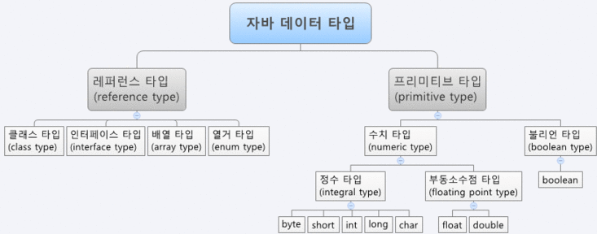

## 프리미티브 타입 종류와 값의 범위 그리고 기본 값

기본형(프리미티브) 타입에는 모두 여덟개의 타입이 있으며, 크게 논리형, 문자형, 정수형, 실수형으로 나뉜다.


 - 타입 종류
   
   |분류|타입|
   |:------|:---|
   |논리형|boolean|
   |문자형|char|
   |정수형|byte, short, int, long|
   |실수형|float, double|
     - 논리형(boolean)

       true와 false 중 하나를 값으로 갖으며, 조건식과 논리적 계산에 사용된다.

       boolean은 기본형과의 연산이 불가능하다. boolean을 제외한 나머지 일곱개의 타입은 연산이 가능하다.

     - 문자형(char)

       문자를 저장하는데 사용되며, 변수에 하나의 문자만 저장할 수 있다.

       문자형인 char는 문자를 내부적으로 유니코드로 저장하기 때문에 정수형과 다를게 없으며, 정수형 또는 실수형과 연산도 가능하다.

     - 정수형(byte, short, int, long)

       정수를 저장하는데 사용되며, byte는 이진 데이터를 다룰 때 사용되며, short는 C언어와의 호환을 위해 추가되었다.

       일반적으로 int 타입을 주로 사용하는데, 이는 int 타입은 CPU가 가장 효율적으로 처리할 수 있는 타입이기 때문이다.

     - 실수형(float, double)

       실수를 저장하는데 사용되며, 주로 double이 사용된다.

       float는 실수값을 부동 소수점 방식으로 저장하기 때문에 float이고, double은 float보다 두 배의 크기를 갖기 때문에 double이다.

       float는 정밀도가 일곱자리까지만 정확하기 때문에 그 뒷자리부터는 값이 정확하지 않다. 그러므로 보다 높은 정밀도가 필요한 경우 double 타입을 선택해야한다.
     
- 값의 범위
  
    |자료형|값의 범위|bit|byte|
    |:------|:---|:---|:---|
    |boolean|false, true|8|1|
    |char|0 ~ 2^16 - 1|16|2|
    |byte|-2^7 ~ 2^7 - 1|8|1|
    |short|-2^15 ~ 2^15 - 1|16|2|
    |int|-2^31 ~ 2^31 - 1|32|4|
    |long|-2^63 ~ 2^63 - 1|64|8|
    |float|1.4 * 10^-45 ~ 3.4 * 10^38|32|4|
    |double|4,9 * 10^-324 ~ 1.8*10^308|64|8|
 - 기본 값

    |자료형|기본 값|
    |:------|:---|
    |boolean|false|
    |byte|0|
    |short|0|
    |int|0|
    |long|0|
    |float|0.0f|
    |double|0.0|
    |char|'\u0000'|

## 프리미티브 타입과 레퍼런스 타입

- 프리미티브 타입과 레퍼런스 타입의 차이점

  

  (자료출처 : [https://blog.naver.com/corea4015/220648085184](https://blog.naver.com/corea4015/220648085184))

    프리미티브 타입은 위에서 설명한 내용을 확인하면 되고, 레퍼런스(참조형) 타입은 프리미티브 타입 이외의 타입이다.

- 레퍼런스 타입

  참조 타입(레퍼런스 타입)은 new 키워드를 이용하여 객체를 생성하고, 생성된 데이터의 주소를 참조한다.

  참조 타입의 종류는 class, array, interface, emun이 있다.

  참조 타입의 데이터는 크기가 가변적, 동적이기 때문에 동적으로 관리되는 heap 영역에 저장이 된다.

## 리터럴
리터럴은 값 그 자체이다. 수학에서의 상수는 변하지 않는 값이다. 마찬가지로 자바에서 상수라는 표현은 final이라는 키워드로 한번 선언되면 변경할 수 없다는 의미로 사용되고 있다. 이러한 의미적 혼동을 구분하기 위해서 리터럴이라는 표현을 사용한다.

```java
int year = 2014;
final int MAX_VALUE = 100;
```

위의 코드에서 첫번 째 줄 year는 변수를, 2014는 리터럴을 뜻한다.

그 밑의 코드에서 MAX_VALUE 는 상수(final 키워드가 있기 때문)를, 100은 리터럴을 의미한다.

## 변수 선언 및 초기화하는 방법
- 변수 선언 방법

    ```java
    int number;
    ```

  앞의 'int'는 변수 타입을, 'number'는 변수 이름을 뜻한다. 정리하면, int타입의 number라는 이름의 변수를 선언한 것이다.

  변수 타입에는 앞서 설명한 어떠한 타입인지를 나타내야 하고, 변수 이름은 말 그대로 변수의 이름을 나타낸 것이다.

  그러므로 변수를 선언하면, 메모리의 빈 공간에 변수 타입에 알맞는 크기의 저장공간이 확보되고, 변수 이름을 통해 사용할 수 있게 된다.

- 변수 초기화 방법

  변수를 선언한 후 반드시 초기화를 해야한다. 메모리는 여러 프로그램이 공유하는 자원이므로 전에 다른 프로그램에 의해 garbage value로 남아있을 수 있기 때문이다.

  변수에 값을 저장할 때 대입 연산자 '='를 이용한다. 원래의 대입 연산자는 같다(equal)의 의미이지만, 자바에서는 오른쪽의 값을 왼쪽에 대입한다는 의미로 쓰인다. 그러므로 대입연산자의 왼쪽에는 반드시 변수가 위치해야 한다.

    ```java
    int number = 1; // 변수 number를 선언하고, 1로 초기화한다.
    ```

## 변수의 스코프와 라이프타임

- 변수의 스코프

  변수는 클래스 변수, 인스턴스 변수, 지역 변수 모두 세 종류이다. 변수의 종류를 결정짓는 요소는 변수의 선언된 위치로, 변수의 종류를 확인하기 위해서는 어느 영역에 선언되어있는지를 확인해야한다.

  멤버 변수를 제외한 나머지 변수들은 지역 변수이며, 멤버 변수 중 static이 붙은 것은 클래스 변수, 붙지 않은 것은 인스턴스 변수이다.

    ```java
    class Main {
    	int iv; // 인스턴스 변수
    	static int cv; // 클래스 변수
    	
    	void method() {
    		int lv = 0; // 지역 변수
    	}
    }
    ```

    - 인스턴스 변수

      클래스 영역에 선언되며, 클래스의 인스턴스를 생성할 때 만들어진다. 인스턴스 변수의 값을 읽어오거나 저장하기 위해서는 먼저 생성해야한다. 인스턴스는 독립적인 저장공간을 가지므로 서로 다른 값을 가질 수 있다. 인스턴스마다 고유한 상태를 유지해야 하는 속성의 경우, 인스턴스 변수로 선언한다.

    - 클래스 변수

      클래스 변수를 선언하기 위해서는 인스턴스 변수 앞에 static 키워드를 붙이면 된다. 클래스 변수는 인스턴스 변수와는 달리 공통된 저장공간을 공유하기 때문에 모든 인스턴스들이 공통적인 값을 유지해야 하는 경우, 클래스 변수로 선언한다.

    - 지역 변수

      메서드 내에 선언되며, 메서드 내에서만 사용할 수 있다. 메소드 안에서도 for문이나 while문 등 블럭 내에 선언된 변수 또한 블럭을 벗어나면 소멸되어 사용 할 수 없다.

- 변수의 라이프 타임
    - 인스턴스 변수

      인스턴스 변수는 오브젝트 소유 기간 동안 메모리에 상주한다.

    - 클래스 변수

      클래스가 메모리에 로드되는 순간 생성되며, 클래스가 종료되면 소멸한다.

    - 지역 변수

      해당하는 메서드, for, while문 등이 종료되는 순간 소멸한다.

## 타입 변환, 캐스팅 그리고 타입 프로모션

- 형변환이란?

  타입간의 연산을 수행하기 위해서는 타입을 일치시켜야 한다는 약속이 있다. 하지만 서로간의 타입이 다르다면 타입을 하나로 맞추기 위해서 다른 하나의 타입을 변환해야 하는데, 이를 형 변환이라고 한다. 좀 더 자세히 설명하자면, 변수나 리터럴의 타입을 다른 타입으로 변환 하는 것을 형 변환이라고 한다.

- 캐스팅과 프로모션

  형변환 하는 과정에서 데이터 타입의 크기에 따라 캐스팅과 프로모션으로 나눈다.

    - 캐스팅

      큰 데이터 타입에서 작은 데이터 타입으로 형 변환 하는 것을 뜻한다.

    - 프로모션

      작은 데이터 타입에서 큰 데이터 타입으로 형 변환 하는 것을 뜻한다.

- 형변환 방법

  형 변환 방법에는 괄호에 형 변환할 타입을 입력하면 된다.

    ```java
    int number = 1;
    double number2 = (double)number; // 1.0
    ```

  int 타입은 소수점을 관리하지 않는다. 그렇기 때문에 double 타입에서 int 타입으로 변환할 때는 반올림이 아닌 버림을 사용한다는 것을 주의해야 한다.

- 자동 형변환

  위에서는 괄호 안에 타입을 선언하지만, 경우에 따라 형변환을 생략할 수 있다. 이는 형변환이 이루어진 것이 아니라 컴파일러가 생략된 형변환을 추가해 준 것이다.

  이 때 규칙이 있는데, 작은 데이터 타입에서 큰 데이터 타입으로 변경해야한다.

    ```java
    int number = 1;
    double number2 = number;
    ```

- 정리
    - boolean을 제외한 나머지 일곱개의 기본형은 서로 형변환이 가능하다.
    - 기본형과 참조형은 서로 형변환할 수 없다.
    - 서로 다른 타입의 변수간의 연산은 형변환을 하는 것이 원칙이지만, 값의 범위가 작은 타입에서 큰 타입으로의 변환은 생략이 가능하다.

## 1차 및 2차 배열 선언하기

- 1차 배열 선언 및 생성

  먼저 1차 배열 선언은 의도하는 타입의 변수를 선언하고 대괄호를 붙이면 된다.

    ```java
    //1번
    int[] nums;
    int nums[];
    ```

  위의 코드를 보면 타입 뒤에 붙이거나 변수 뒤에 붙이는데, 어디에 붙이든 상관은 없지만 보통 타입 뒤에 붙인다.

  그다음은 생성인데, 여기서 new 연산자를 이용하여 배열의 타입과 길이를 정해주어야 한다.

    ```java
    //2번
    int[] nums = new int[10] // 길이가 10인 int 타입의 변수 nums
    ```

  위의 코드박스를 각각 1번, 2번으로 이름을 붙여 설명을 하자면, 1번에서는 아직 nums라는 변수만 생성했기 때문에 데이터 저장공간은 없다. 하지만 2번의 new 연산자를 통해 저장공간을 마련하였다. 추가로 설명하자면, 따로 int 타입의 값을 입력하지 않았기 때문에 기본값인 0이 저장되어있다. 그 다음 대입 연산자를 통해 int 타입의 배열 nums 라는 변수는 'new int[10]'라는 배열요소에 저장된다.

- 2차원 배열의 선언과 생성

  2차원 배열의 선언과 생성을 같이 해보자면,

    ```java
    int[][] nums = new int[10][10];
    ```

  위의 코드처럼 생성하면 된다. 1차원 배열과는 다르게 대괄호가 하나씩 더 추가되었다. 이는 10행 10열의 배열을 뜻한다.

## 타입 추론, var

- 타입 추론이란?

  타입 추론이란 코드 작성 당시 타입이 정해지진 않았지만, 컴파일러가 그 타입을 유추하는 것이다. 자바에서의 타입 추론은 제네릭과 람다에 대한 타입 추론을 뜻한다.

- var

  자바 10부터 타입 추론을 지원하는 var 키워드가 추가되었다. 이 키워드는 지역 변수이면서 선언과 동시에 초기화가 필요하다.

    ```java
    class Main {

    	void method() {
    		var str = "Hello!";
    	}
    }
    ```

    - 주의사항

      자바 7에서 다이아몬드 연산자 방식이 추가되었는데, var와 함께 사용하면 컴파일 에러가 발생한다. 그 이유는 컴파일러가 타입을 유추할 방법이 없기 때문이다.

        ```java
        var str = new ArrayList<>(); // error
        ```


자료참조

자바의 정석 3rd Edition(남궁 성 저)

https://gbsb.tistory.com/6

[https://ko.wikipedia.org/wiki/인스턴스_변수](https://ko.wikipedia.org/wiki/%EC%9D%B8%EC%8A%A4%ED%84%B4%EC%8A%A4_%EB%B3%80%EC%88%98)

[https://tedock.tistory.com/75](https://tedock.tistory.com/75)

[https://velog.io/@bk_log/Java-타입-추론](https://velog.io/@bk_log/Java-%ED%83%80%EC%9E%85-%EC%B6%94%EB%A1%A0)