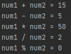
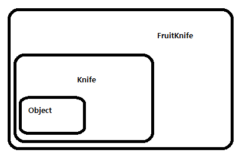

## 산술 연산자

- 산술 연산자란?

  산술 연산자는 사칙연산(+, -, *, /)와 나머지 연산자(%)가있다. 나머지 연산자는 나눈 나머지의 값을 계산한다.

    ```java
    public static void main(String[] args) {
        int num1 = 10;
        int num2 = 5;

        System.out.println("num1 + num2 = " + (num1 + num2)); //15
        System.out.println("num1 - num2 = " + (num1 - num2)); //5
        System.out.println("num1 * num2 = " + (num1 * num2)); //50 
        System.out.println("num1 / num2 = " + (num1 / num2)); //2
        System.out.println("num1 % num2 = " + (num1 % num2)); //0
    }
    ```

    - 출력결과

      !

  연산 결과는 기본적으로 int 타입이기 때문에 소수점은 모두 버려진다.

- 유니코드 연산

  [https://t1.daumcdn.net/cfile/tistory/9950783F5A322ACB02](https://t1.daumcdn.net/cfile/tistory/9950783F5A322ACB02)

  출처 : [https://coding-factory.tistory.com/74](https://coding-factory.tistory.com/74)

  위의 표를 보면 알파벳 a부터 z까지는 10진수로 97부터 122까지이다. 만약 char타입으로 a에 1을 더할 때 어떻게 출력되는지 아래의 예시를 통해 알아보자.

    ```java
    public static void main(String[] args) {
        char a = 'a';
        System.out.println(a + 1); // 98
        System.out.println((char)(a+1)); // b
    }
    ```

  char 타입의 a변수 a는 숫자 1을 더하면 int타입의 결과가 출력되고, int타입의 결과를 char 타입으로 감싸면 b가 출력되는 결과를 볼 수 있다.

## 비트 연산자

- 비트 연산자란?

  비트 연산자란 피연산자를 비트단위로 논리 연산한다. 피연산자를 이진수로 표현했을 대의 각 자리를 아래의 규칙에 따라 연산을 수행하며, 피연산자로 실수는 허용하지 않는다. 정수만 허용된다.

  |연산자|설명|
  |:------|:---|
  |(OR연산자)|피연산자 중 한 쪽의 값이 1이면, 1을 결과로 얻는다. 그 외에는 1을 얻는다. |
  |& (AND연산자)|피연산자 양 쪽이 모두 1이어야만 1을 결과로 얻는다. 그 외에는 0을 얻는다.|
  |^ (XOR연산자)|피연산자의 값이 서로 다를 때만 1을 결과로 얻는다. 같을 때는 0을 얻는다.|

  |x|y|x\y|x&y|x^y|
  |---|---|---|---|---|
  |1|1|1|1|0|
  |1|0|1|0|1|
  |0|1|1|0|1|
  |0|0|0|0|0|
  
- 비트 전환 연산자

  전환 연산자는 2진수로 표현했을 때, 0은 1로, 1은 0으로 바꾼다. 이 때 전환되고나면, 부호가 반대로 변경된다. 즉, 피연산자의 1의 보수를 얻을 수 있다. 그래서 비트전환연산자를 1의 보수 연산자라고도 한다.

  예를들어 10을 전환하면 -11이 되고, 이 값은 10의 1의 보수이다. 그러므로 전환 된 값에 1을 더하면 -10이된다.

    ```java
    public static void main(String[] args) {
        byte ten = 10;
        System.out.println(~ten); // -11
    }
    ```

## 관계 연산자
- 관계 연산자란?

  비교 연산자라고 불리며, 두 피연산자를 비교하는 데 사용되는 연산자이다. 주로 조건문, 반복문의 조건식에 사용되며, 결과는 true 와 false입니다. 관계 연산자는 이항 연산자이므로 타입이 서로 다를 경우 범위가 큰 쪽으로 자동 형변환하여 타입을 일치시킨 후 비교한다는 특징이 있다.

- 연산자 종류
    - 대소비교 연산자

      값의 크기를 비교하는 연산자이다. 참이면 true를, 거짓이면 false를 결과로 반환한다. 기본형 타입 중 boolean형을 제외한 나머지 자료형에 다 사용할 수 있지만, 참조형에는 사용할 수 없다.
        
      |비교연산자|연산결과|
      |---|---|
      |' > '|좌변 값이 크면 true, 아니면 false|
      |' < '|좌변 값이 작으면 true, 아니면 false|
      | ' >= '|좌변 값이 크거나 같으면 true, 아니면 false|
      |' <= '|좌변 값이 작거나 같으면 true, 아니면 false|

    - 등가비교 연산자

      값이 같은지 같지 않은지를 비교하는 연산자이다. 기본형 타입은 물론 참조형, 즉 모든 자료형에 사용할 수 있다.

      기본형의 경우 저장되어있는 값이 같은지를 비교하고, 참조형의 경우 객체의 주소값을 저장하기 때문에 두 개의 참조변수가 같은 객체를 가리키고 있는지를 알 수 있다.
    
      |비교연산자|연산결과|
      |---|---|
      |==|두 값이 같으면 true, 아니면 false|
      |!=|두 값이 다르면 true, 아니면 false|

- 예시

    ```java
    public static void main(String[] args) {
        System.out.println(10 == 10.0); //true
        System.out.println(0 != '0'); //true
        System.out.println(10 > 15); //false
        System.out.println(20 >= 20); //true
    }
    ```

## 논리 연산자

- 논리 연산자란?

  논리연산자는 둘 이상의 조건을 'AND'(&&) 또는 'OR'(||)으로 연결하여 하나의 식으로 표현할 수 있게 해준다.

  AND는 두 피연산자가 모두 같은 결과값을 가질때에 true를 가지고, 그렇지 않으면 false를 결과로 얻고, OR은 둘 중 어느 하나만 true이어도 true를 결과로 얻는다.

  |x|y|x ｜｜ y| x && y|
  |:---:|:---:|:---:|:---:|
  |true|true|true|true|
  |true|false|true|false|
  |false|true|true|false|
  |false|false|false|false|

- 예시

    ```java
    public static void main(String[] args) {
        int num = 10;
        System.out.println(num > 5 && num < 15); //true
        System.out.println(num >= 10 || num < 20); //true
    }
    ```

- 논리 부정 연산자 !

  이 연산자는 피연산자가 true이면 false를, false면 true를 결과로 반환한다. 즉, true와 false를 반대로 바꾸는 것이다.

  예를들어 한번 누르면 켜지고, 다시 한번 누르면 꺼지는 TV의 전원버튼과 토글버튼을 논리적으로 구현할 수 있다.

  논리 부정연산자를 잘 사용하면 보기 쉬운 코드로 짤 수 있다. 예를 들어, 문자 ch는 소문자가 아니다 라는 조건을,

    ```java
    if( !('a' <= ch && ch <= 'z') ) {
    	//...
    }
    ```

  위의 코드처럼 입력한다면 보기에도 좋은 코드로 바꿀 수 있다.

## instanceof
- instanceof란?

  참조변수가 참조하고 있는 인스턴스의 실제 타입을 알아보기 위해 instanceof 연산자를 사용한다. instanceof 연산자 왼쪽에는 참조변수를, 오른쪽에는 타입(클래스 명)이 피연산자로 위치한다. 결과는 true와 false 중 하나를 반환한다. 이는 true를 반환받았다면, 참조변수가 검사한 타입으로 형변환이 가능하다는 것을 뜻한다.

- 상속관계에서 instanceof

  아래의 코드예시를 보면 Knife와 FruitKnife의 관계를 통해 instanceof연산자의 결과를 확인할 수 있다.

    ```java
    public class Main {
        public static void main(String[] args) {
            Knife knife = new Knife();
            FruitKnife fruitKnife = new FruitKnife();

            System.out.println(knife instanceof Knife); //true
            System.out.println(knife instanceof FruitKnife); //false
            System.out.println(fruitKnife instanceof Knife); //true
            System.out.println(fruitKnife instanceof FruitKnife); //true
        }
    }

    class Knife {

    }

    class FruitKnife extends Knife {

    }
    ```

  두번째 System.out.print문을 보면, Knife 클래스 타입의 변수 knife는 Knife를 확장한 FruitKnife클래스와 비교하였을 때 포함관계를 고려하여 false를 리턴하였다. 이는 포함관계와도 관련이 있다.

  

  위의 자료를 통해 왜 instanceof 연산자에서 false를 리턴했는지를 알 수 있다.

## assignment(=) operator
- 대입연산자란?

  대입연산자란('=') 변수와 같은 저장공간에 값 또는 수식의 연산결과를 저장하는데 사용된다. 대입연산자의 왼쪽 피연산자를 lvalue(left value), 오른쪽 피연산자를 rvalue(right value)라고 한다. 오른쪽 피연산자의 값을 왼쪽 피연산자에 저장하는 것으로, 아래의 예시 코드를 보면,

    ```java
    int x = 10;
    ```

  오른쪽 피연산자(10)를 왼쪽 피연산자(int 타입의 변수 x)에 저장한 것을 볼 수 있다.

- 복합 대입 연산자

  복합 대입 연산자란 다른 연산자와 결합하여 'op='와 같은 방식으로 사용될 수 있다.

    ```java
    int x = 10;
    x += 10; // x = x + 10
    ```

  'x += 10'은 복합 연산자를 사용한 것이고, 주석 부분의 'x = x + 10'은 복합연산자와 동일한 식이다. 여기서 주의사항이 있다.

    ```java
    x *= 10 + j; // x = x * ( 10 + j );
    ```

  오른쪽 피연산자의 값이 하나가 아닌 둘이다. 이 때 ' x = x * 10 + j '가 아니라는 것을 알아두어야 한다.

  기타 연산자의 종류를 보자.

    ```java
    x += 10; // i = i + 10;
    x -= 10; // i = i - 10;
    x *= 10; // i = i * 10;
    x /= 10; // i = i / 10;
    x %= 10; // i = i % 10;
    ```

## 화살표(->) 연산자

- 화살표 연산자를 보기 전에..

  화살표 연산자는 자바8에 새로 도입된 람다 식 구문 중 일부이다. 화살표 연산자를 알려면 먼저 람다식을 알아야 하는데, 람다식을 알기 전 익명 클래스에 먼저 알아야한다.

- 익명 클래스

  익명 클래스란 말 그대로 이름이 없는 익명인 클래스이다. 익명 클래스의 특징은 동시에 클래스를 선언하고 인스턴스화 할 수 있다. 익명이라는 점을 제외하면 로컬 클래스와 같고, 한 번만 사용하는 경우에 사용한다.

    ```java
    public class Main {
        public static void main(String[] args) {

            PrintName printName = new PrintName() {
                @Override
                public void print(String name) {
                    System.out.println("Hi " + name + "!");
                }
            };

    				//1번
            printName.print("Hong"); // Hi Hong!
        }
    }

    interface PrintName {
        void print(String name);
    }
    ```

  PrintName이라는 인터페이스를 생성하였고, Main클래스에서 PrintName을 타입으로 한 익명클래스를 선언하였다. 익명 클래스 내부의 추상 메서드를 구현하고, 1번에서 PrintName 타입의 변수로 메서드를 호출하였다.

- 익명 클래스의 한가지 문제

  익명 클래스의 한 가지 문제는 하나의 메서드만 포함하는 인터페이스와 같이 익명 클래스의 구현이 매우 간단하다면 익명 클래스의 구문이 다루기 어렵고 명확하지 않은 것처럼 보일 수 있다는 것이다. 이러한 경우 람다 표현식을 보다 간결하게 표현할 수 있다.

- 람다식 사용 방법

    ```java
    public class Main {
        public static void main(String[] args) {

            PrintName printName = name -> System.out.println("Hi " + name + "!");
            printName.print("Hong");
        }
    }

    @FunctionalInterface
    interface PrintName {
        void print(String name);
    }
    ```

  위의 익명 클래스를 선언한 것을 람다식으로 바꾼 결과이다. 이 중 눈여겨 볼 점이라면 화살표 연산자와 @FunctionalInterface 어노테이션이다. @FunctionalInterface어노테이션은 지금 다루고 있는 주제를 벗어나므로 [링크](https://docs.oracle.com/javase/8/docs/api/java/lang/FunctionalInterface.html) 를 통해 확인하면 된다.

- 화살표 연산자

  람다식의 가운데에 화살표 연산자(' → ')를 기준으로 왼쪽은 매개변수를, 오른쪽은 구현부를 나타낸다. 위의 익명클래스의 코드 예시에 (String name)이라는 부분이 화살표 연산자를 기준으로 왼쪽의 매개변수를 나타내고, 익명 클래스 코드 예시에 추상 메서드 구현부가 화살표를 기준으로 오른쪽을 나타낸다.

  매개변수를 표시할 때 명시적으로 타입을 나타내도 되지만 나타내지 않아도 된다. 그리고 매개변수가 두개일 경우는 소괄호 안에 표시해야한다.

  구현부를 나타낼 때 한줄로 끝나는 경우는 어떠한 괄호 없이 표현할 수 있지만, 두 줄이 되는 경우 중괄호 안에 구현해야 하며, 중괄호가 끝나면 끝에 꼭 세미콜론을 붙여야한다.

    ```java
    public class Main {
        public static void main(String[] args) {

            PrintName printName = (firstName, lastName) -> {
                System.out.println("Hi " + firstName + "!");
                System.out.println("Last name is " + lastName);
            };
            printName.print("Hong", "GilDong");
        }
    }

    @FunctionalInterface
    interface PrintName {
        void print(String firstName, String lastName);
    }
    ```

## 3항 연산자

- 삼항 연산자란?

  삼항 연산자는 조건식, 식1, 식2 모두 세 개의 피연산자를 필요로 하는 삼항 연산자이며, 삼항 연산자는 조건 연산자 하나뿐이다.

    ```java
    //조건식 ? 식1(true) : 식2(false)
    int x = 10;
    int y = 5;
    int result = ( x > y ) ? x : y;
    ```

  위의 코드를 보면, 조건식의 결과가 true인지 false인지를 나타내야한다. 그에 따른 결과가 true이면 식1을, false이면 식2를 저장하는 구조이다.

  값이 10인 x와 5인 y를 비교하는 삼항 연산자를 만들어보았다.  x > y는 참이다. 그러므로 식1(true)의 값을 저장하기 때문에 result의 값은 10이된다. 만약 결과가 false라면 식2(false)의 값을 저장하기 때문에 5가 저장된다.

    ```java
    int x = 10;
    int y = 5;
    int result = 0;

    //1번
    if( x > y ) {
    	result = x;
    } else {
    	result = y;
    }

    //2번
    int result = ( x > y ) ? x : y;
    ```

  1번의 if, else와 2번과는 같은 식이다. 서로 바꾸어 쓸 수 있으며, 간단한 식의 경우 삼항 연산자를 사용하는게 더 간결하다.

## 연산자 우선 순위

- 연산자 우선 순위

  식에 사용된 연산자가 둘 이상인 경우, 연산자의 우선순위에 의해 연산순서가 결정된다. 수학에서처럼 곱셉 나눗셈이 덧셈 뺄셈보다 우선순위가 높은 것처럼 연산자도 마찬가지다. 예시를 들어서 하나하나 우선순위에 대해 알아보자

    - 비교 연산자와 산술 연산자

        ```java
        x + 3 > y + 2
        ```

      위의 경우 산술 연산자가 먼저 수행되고나서 비교 연산자가 수행된다.

    - 논리 연산자와 비교연산자

        ```java
        x > 3 && y < 5
        ```

      위의 경우 비교 연산자가 먼저 수행되고, 그 다음 논리 연산자가 수행된다.

    - 대입연산자와 나머지 연산자

        ```java
        result = x + y * 3
        ```

      위의 경우 나머지 연산이 끝나고나서 대입연산이 이루어진다.

    - 논리 연산자들의 우선순위

        ```java
        x > 3 || x < 0 && y > 0
        ```

      위의 경우 AND(&&)가 OR(||)보다 우선순위가 높다. 그러므로 함께 사용되는 경우는 괄호를 통해 우선순위를 명확하게 하는 것이 좋다.

- 연산자의 결합규칙

  단항 연산자(++, —, +, -, ~, ! 등), 대입 연산자는 오른쪽에서 왼쪽의 순서로 연산을 수행하고, 나머지는 왼쪽에서 오른쪽으로 수행한다.

- 정리
    1. 산술 > 비교 > 논래 > 대입 순으로 수행된다.
    2. 단항(1) > 이항(2) > 삼항(3). 단항 연산자의 우선순위가 이항 연산자보다 높다.
    3. 단항 연산자와 대입 연산자를 제외한 모든 연산의 진행방향은 왼쪽에서 오른쪽이다.

## (optional) Java 13. switch 연산자

자료참조

자바의 정석 3rd Edition(남궁 성 저)

[https://docs.oracle.com/javase/tutorial/java/javaOO/lambdaexpressions.html#use-case](https://docs.oracle.com/javase/tutorial/java/javaOO/lambdaexpressions.html#use-case)

[https://docs.oracle.com/javase/tutorial/java/javaOO/anonymousclasses.html](https://docs.oracle.com/javase/tutorial/java/javaOO/anonymousclasses.html)