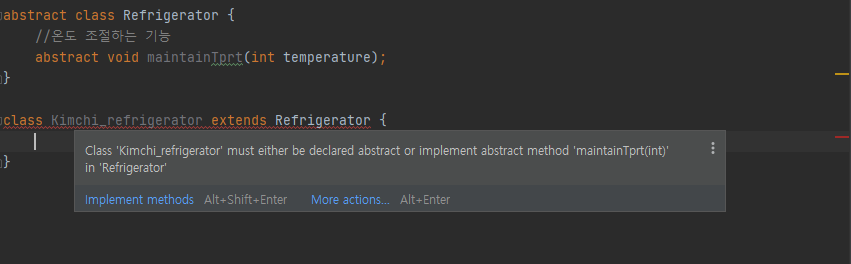
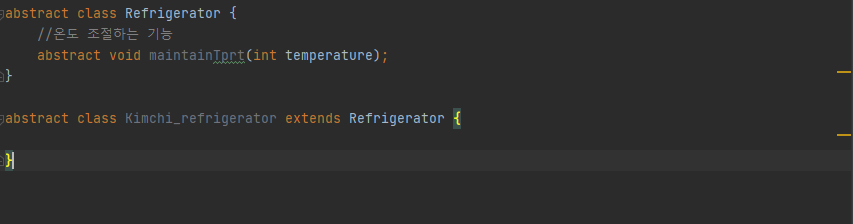

## 자바 상속의 특징

- 유지 보수에 용이하다.

  상속의 특징 중 하나로, 클래스를 재사용하여 클래스를 작성하면 보다 적은 양의 코드로 새로운 클래스를 작성할 수 있어 코드의 추가 및 변경이 용이하다. 또한 재사용성을 높이고 중복을 제거하여 용이한 유지보수에 도움이 된다.

- 단일 상속

  자바에서는 다중 상속을 지원하지 않고, 오직 단일 상속만을 허용한다. 그 이유는 클래스 간의 관계가 매우 복잡해진다는 것과 서로 다른 클래스로부터 상속받은 멤버간의 이름이 같은 경우 구별할 수 있는 방법이 없다는 단점을 가지고있다.

  예를 들어 클래스 A와 클래스 B 둘 다 playMusic()이라는 메소드가 두 메서드를 구별할 수 있는 방법은 없다.

- 상속에 제한이 없다.

  말 그대로 상속을 받은 클래스를 새로운 클래스에서 상속을 받을 수 있으며, 상속에 제한이 없다.

자료참조

자바의 정석 3rd Edition(남궁 성 저)

## super 키워드

- super

  상속 받은 멤버와 클래스 내의 멤버와 이름이 같을 때는 super를 붙여 구별할 수 있다. 조상의 멤버와 자신의 멤버를 구별하는데 사용된다는 점을 제외하고는 super와 this는 근본적으로 같다. 모든 인스턴스 메서드에는 자신이 속한 인스턴스의 주소가 지역변수로 저장되는데, 이것이 참조변수인 this와 super값이 된다.

    ```java
    class Test {
    	public static void main(String[] args) {
    		Child child = new Child();
    		child.method();
    	}
    }

    class Parent {
    	int num = 100;
    }

    class Child extends Parent {
    	int num = 200;

    	void method() {
    		System.out.println("num = " + num);
    		System.out.println("this.num = " + this.num); // 200
    		System.out.println("super.num = " + super.num); // 100
    	}
    }
    ```

- super()

  super 옆에 소괄호가 붙으면 생성자를 뜻한다. 이는 조상 클래스의 생성자를 호출하는데 사용된다. 자손 클래스의 인스턴스를 생성하면, 자손의 멤버와 조상의 멤버가 모두 합쳐진 하나의 인스턴스가 생성된다. 그래서 자손 클래스의 인스턴스가 조상 클래스의 멤버들을 사용할 수 있게된다. 이 때 조상 클래스 멤버의 초기화 작업이 수행되어야 하기 때문에 자손 클래스의 생성자에서 조상 클래스의 생성자가 호출되어야 한다.

  자손 클래스의 생성자의 첫 줄에는 조상 클래스의 생성자를 호출해야하는데, 그 이유는 자손 클래스의 멤버가 조상 클래스의 멤버를 사용할 수 있기 때문에 먼저 초기화가 되어있어야 한다.

  조상클래스는 또다른 조상클래스를 호출해서 결국 Object 클래스의 생성자까지 도달하면 호출은 완료된다.

  아래는 호출방법과 사용예제, 출력결과이다.

    ```java
    class Test {
    	public static void main(String[] args) {
    		Child child = new Child();
    		child.method();
    	}
    }

    class Parent {
    	int num1;
    	
    	public Parent() {
    		num1 = 1;
    	}
    	
    	public Parent(int a) { //1번
    		num1 = a;
    	}
    }

    class Child extends Parent {
    	int num2;

    	public Child() { // 2번
    		super(5); 
    		num2 = 2;
    	}

    	void method() { //3번
    		System.out.println("num1 : " + num1); //5
    		System.out.println("num2 : " + num2); //2
    	}
    }
    ```

  마지막 Child 클래스의 method() 메서드 안에 출력 부분을 보면 num1의 값이 5인 것을 알 수 있다. 그 이유는 2번의 super(5) 때문이다. 또한 Child 클래스에서 num1을 선언하지 않아도 상속관계이기 때문에 조상 클래스의 필드에 선언된 변수를 사용할 수 있다.

  2번의 super(5)는 조상 클래스의 생성자를 호출했다. 중요한 건 매개변수에 값이 있다는 것이다. 이는 매개변수가 있는 생성자를 호출하였기 때문에 조상 클래스의 필드 변수는 매개변수가 있는 1번의 생성자에 의해 값이 대입되었다.

  만약 2번의 super() 생성자가 매개변수가 없는 기본 생성자였다면 3번을 호출하였을 때 num1의 값은 1로 출력되었을 것이다.

  또한 2번에서 super() 생성자를 호출하지 않아도 num1의 값은 1로 출력될 것이다. 그 이유는 자동으로 super()를 생성해주기 때문이다.

자료참조

자바의 정석 3rd Edition(남궁 성 저)

[http://www.tcpschool.com/java/java_inheritance_super](http://www.tcpschool.com/java/java_inheritance_super)

## 메소드 오버라이딩
- 메소드 오버라이딩이란?

  조상 클래스로부터 상속받은 메서드의 내용을 변경하는 것을 오버라이딩이라고 한다. 조상 클래스에서 생성된 메서드를 그대로 사용 할 수 있고, 상속받는 클래스에 맞게 변경할 수도 있다. 예시로 흔히 toString() 메서드를 오버라이딩을 통해 변경하는 경우를 생각하면 된다.

    ```java
    public class TestVO {
        String name;
        int age;

    		//....

        @Override
        public String toString() {
            return "test{" +
                    "name='" + name + '\'' +
                    ", age=" + age +
                    '}';
        }
    }
    ```

  위의 코드는 DB와 JAVA간의 변환을 담당하는 DTO(Data Transfer Object)의 일부분이다. 다른 클래스에서 TestVO 클래스의 필드값을 확인하고 싶다면 toString() 메서드를 재정의 하는 방법이 대표적이다. 만약 오버라이딩을 하지 않는다면 객체의 주소값이 반환된다.

- 메소드 오버라이딩시 주의할 점
  - 이름이 같아야 한다.
  - 매개변수가 같아야 한다. (매개변수가 다르다면 오버로딩이 된다.)
  - 반환타입이 같아야 한다.
  - 접근제어자는 조상클래스의 메서드보다 좁은 범위로 변경할 수 없다.
  - 조상 클래스의 메서드보다 많은 수의 예외를 선언할 수 없다.
  - 인스턴스 메서드를 스태틱 메서드로, 또는 그 반대로 변경할 수 없다.

  정리하자면 선언부가 일치해야 한다. 다만 접근 제한자 또는 예외는 제한된 조건 하에 변경이 가능하다.

- 오버로딩(Overloading)과 오버라이딩(Overriding)

  이름이 비슷하다고 헷갈리는 경우가 있다. 하지만 각각의 특징을 이해하면 헷갈리는 부분을 해소할 수 있을 것이다.

  - 오버로딩(Overloading)

    기존에 없던 새로운 메서드를 정의하는 것을 뜻한다.

  - 오버라이딩(Overriding)

    상속받은 메서드의 내용을 재정의하는 것이다.

  - 코드 예시

      ```java
      class Parent {
          void parentMethod() {}
      }

      class Child extends parent {
          void parentMethod() {} // 오버라이딩
          void parentMethod(int n) {} // 오버로딩
      }
      ```

자료참조

자바의 정석 3rd Edition(남궁 성 저)

## 다이나믹 메소드 디스패치 (Dynamic Method Dispatch)
- 다이나믹 메소드 디스패치란?

  다이나믹 메소드 디스패치는 재정의 된 메서드에 대한 호출이 컴파일 타임이 아닌 런타임에 해석되는 프로세스이다. 오버라이드 된 메소드가 참조에 의해 호출 될 때 자바는 참조하는 객체 유형에 따라 실행할 메소드 버전을 판별한다. 만약 런타임과 컴파일타임에 대해 모른다면 간락햐게 알고 넘어가는게 이해에 큰 도움이 된다.

- 런타임과 컴파일타임
  - 런타임

    컴파일 과정을 마친 응용 프로그램이 사용자에 의해 실행되어지는 때를 의미한다.

  - 컴파일타임

    개발자에 의해 개발 언어로 소스코드가 작성되며, 컴파일 과정을 통해 컴퓨터가 인식할 수 있는 기계어 코드로 변환되어 실행 가능한 프로그램이 되는 과정을 의미한다.

  정리하자면 컴파일 타임 → 컴파일 → 런타임 순이라고 보면 된다.

- 예제 코드

    ```java
    interface Parent {
        void method();
    }

    class Child implements Parent {

        @Override
        public void method() {
            System.out.println("method overridden in child method");
        }

        public void childMethod() {
            System.out.println("starting from child method");
        }
    }

    class MainTest {
        public static void main(String[] args) {
            Parent parent = new Child();
            parent.method(); //method overridden in child method
            //parent.childMethod(); //에러
        }
    }
    ```

  Parent 인터페이스에서 메서드 하나를 생성하고 Child 클래스에서 Parent 인터페이스를implement 했다. 인터페이스는 강제성이 있기 떄문에 반드시 override를 해주었고, 재정의하면서 Child 클래스에서 재정의 했다는 내용을 기록하였다.

  그리고 MainTest 클래스에서 Parent parent = new Child(); 를 선언하고 parent.method(); 를 실행시키면 오른쪽의 주석과 같은 결과가 나온다. 하지만 Child 클래스에서 생성한 childMethod() 메서드는 객체 parent가 호출하지 못한다. 여기서 다이나믹 메소드 디스패치의 특징이 확실하게 드러난다. 특징을 확실하게 이해하려면 스태틱 메소드 디스패치에 대해 간략히 알아야한다.

  - 스태틱 메소드 디스패치(Static Method Dispatch)

    컴파일 시점에서, 컴파일러가 특정 메소드를 호출할 것이라는 것을 명확하게 알고있는 경우이다. 이는 런타임 시점이 되지 않아도 이미 결정이 되어있는 상태로, 함수를 오버로딩하여 사용하는 경우, 인자의 타입이나 리턴타입 등에 따라 어떤 메서드가 호출될 지 명확하기 때문에 이 경우 컴파일러가 명확하게 알고있는 경우에 해당한다. 예를들어,

      ```java
      Child child = new Child();
      ```

    위와 같은 코드는 스태틱 메소드 디스패치에 해당한다.

  다시 돌아와서 Parent parent = new Child(); 이 부분이 동적 메소드 디스패치에 해당이 된다. 그 이유는 Child 클래스에 선언된 childMethod() 메소드가 있기 때문이다. 객체 parent는 childMethod() 메서드에 접근할 수 없다. 이는 컴파일 시점에서 객체 parent는 바인딩 되어있는 클래스가 어떤 클래스인지 확실하게 모른다는 뜻이다. 그러므로 디스패쳐는 parent 객체 정의 부분만 보고는 확실한 판단을 내릴수가 없는 것이다. 그렇기 때문에 parent.method();는 런타임 시 호출되고, 다이나믹 메소드 디스패치에 해당한다.

자료참조

[https://riptutorial.com/ko/java/example/28573/동적-메서드-디스패치---예제-코드](https://riptutorial.com/ko/java/example/28573/%EB%8F%99%EC%A0%81-%EB%A9%94%EC%84%9C%EB%93%9C-%EB%94%94%EC%8A%A4%ED%8C%A8%EC%B9%98---%EC%98%88%EC%A0%9C-%EC%BD%94%EB%93%9C)

[https://defacto-standard.tistory.com/413](https://defacto-standard.tistory.com/413)

[https://dd-corp.tistory.com/9](https://dd-corp.tistory.com/9)

## 추상 클래스

- 추상 클래스란?

  추상클래스란 추상메서드를 포함하고 있는 클래스로, 추상메서드가 있는 특징을 제외하면 일반 클래스와 큰 차이는 없다. 생성자를 생성할 수 있고, 멤버변수와 메서드도 가질 수 있다.

  앞서 설명했듯 추상클래스는 완전한 클래스의 역할을 할 수 없지만 새로운 클래스를 작성하는데 있어 바탕이 되는 조상클래스로서 중요한 역할을 한다. 실생활을 비유로 하면 냉장고로 예시를 들 수 있다. 냉장고도 여러 가지의 냉장고가 있다. 김치 냉장고, 와인 냉장고, 화장품 냉장고 등 이 냉장고들의 온도를 유지하는 방법은 동일할 것이다. 그렇다면 각자 따로 설계하는 것보다 공통부분만을 설계해놓은 설계도를 만들어 놓고,  각자의 특징에 맞는 부분만 따로 설계하는 것이 더욱 효율적일 것이다. 다시 돌아와서, 추상 클래스는 위의 예시처럼 클래스를 사용 할 때, 클래스 선언부의 abstract를 보고 상속을 통해 추상 메서드를 구현해야하는 것을 이해할 수 있어야 한다.

  아래의 코드를 통해 작성 방법과 구현방법에 대해 간단히 알아보겠다.

- 추상 클래스, 추상 메서드 작성 방법

    ```java
    abstract class Refrigerator { //1번
        //온도 조절하는 기능
        abstract void maintainTprt(int temperature);
    }

    class Kimchi_refrigerator extends Refrigerator {// 2번

        @Override
        void maintainTprt(int temperature) {
            System.out.println("온도 " + temperature + "로 유지");
        }
    }
    ```

  맨 위 1번은 추상 클래스를 생성했다. 냉장고라는 추상 클래스에 설정한 온도를 유지하는 기능인 추상 메서드를 추가했다. 위에서 보면 알 수 있듯, 추상 클래스 또는 추상 메서드를 작성할 때 'abstract' 라는 키워드를 앞에 붙여준다. 그 다음은 2번인 구현하려는 클래스 부분으로, 선언부 끝부분에 'extends Refrigerator' 는 추상 클래스를 구현하겠다는 뜻이다.  만약 추상클래스의 추상메서드를 구현하지 않으면 아래와 같은 경고가 표시된다.
  
  
  *'Class 'Kimchi_refrigerator' must either be declared abstract or implement abstract method 'maintainTprt(int)' in 'Refrigerator''*

  쉽게 말해 구현하라는 뜻이다. 해당 추상 클래스의 추상 메서드를 모두 구현하면 경고는 사라지게 된다.

  혹시라도 상속 받은 추상 메서드 중 하나라도 구현하지 않는다면, 자손 클래스 역시 추상클래스로 지정해야 한다.

    ```java
    abstract class Refrigerator {
        //온도 조절하는 기능
        abstract void maintainTprt(int temperature);
    }

    abstract class Kimchi_refrigerator extends Refrigerator {

    }
    ```

  'Kimchi_refrigerator' 클래스의 선언부 'abstract'가 위의 코드의 핵심 부분이다.

  

  'abstract' 키워드를 추가하면 아까와는 다른 결과를 보여준다.

자료참조

자바의 정석 3rd Edition(남궁 성 저)

## final 키워드

- final 이란?

  final은 제어자 중의 하나로 클래스, 변수, 메서드 선언부에 함께 사용되어 부가적인 의미를 부여해준다. final 이외에 static, abstract 등등 여러가지를 함께 사용할 수도 있다. 그 중 final을 사용하면 클래스, 변수, 메서드가 어떻게 적용되는지에 대해 알아보자.
  
  |<center>대상</center>|<center>의미</center>|
  |:------|:---|
  |클래스|변경될 수 없는 클래스, 확장될 수 없는 클래스가 된다. 그래서 final로 지정된 클래스는 다른 클래스의 조상이 될 수 없다.|
  |메서드|변경될 수 없는 메서드, final로 지정된 메서드는 오버라이딩을 통해 재정의 될 수 없다.|
  |멤버변수, 지역변수|변수 앞에 final이 붙으면, 값을 변경할 수 없는 상수가 된다.|
  

  위의 표를 통해 final은 Immutable/Read-only 속성을 선언하는 지시어라는 것을 알 수 있다. 변수에 사용되면 값을 변경할 수 없는 상수가 되며, 메서드에 사용하면 오버라이드가 안되고, 클래스에서 사용하게 되면 확장될 수 없는 클래스가 된다. 아래 코드를 통해 알아보자.

- 각 대상 별 작성 방법
  - 클래스

      ```java
      public final class FinalClass {
          //...
      }

      public class TestClass extends FinalClass {
          //...
      }
      ```

    TestClass 클래스에서 FinalClass를 상속 받으려 한다면, *'Cannot inherit from final 'FinalClass''* 과 같은 오류가 발생한다. final class의 예시로 String 클래스가 있다.

  - 메서드

      ```java
      class FinalTest {
          void method1() {}
          final void method2() {};
      }

      class MainTest extends FinalTest {

          @Override
          void method1() {
              super.method1(); // 1번 Override 가능
          }
          
          void method2() {}; // 2번 'method2()' cannot override 'method2()' in 'FinalTest'; overridden method is final
      }
      ```

    1번 method1() 메소드는 정상적으로 오버라이딩이 되었지만 2번에서의 method2() 메서드는 오버라이딩을 할 수 없는 상태라는 것을 알 수 있다. 이는 조상 클래스 FinalTest의 method2() 메서드가 final 제어자가 추가되었기 때문이다.

  - 변수

      ```java
      class MainTest{

          final double PI = 3.14;
          
          void method1() {
              PI = 3.141; // 2번 Cannot assign a value to final variable 'PI'
          }
          
      }
      ```

    위는 상수를 선언할 때의 경우이다. 보통 변수명은 대문자로 하는 것이 일반적이고, 한번 선언되면 변경이 불가하다는 특징을 가지고있다. 2번의 경우에는 오류가 발생한다.

자료참조

자바의 정석 3rd Edition(남궁 성 저)

[https://blog.lulab.net/programming-java/java-final-when-should-i-use-it/](https://blog.lulab.net/programming-java/java-final-when-should-i-use-it/)

## Object 클래스

- java.lang 패키지는 자바 프로그래밍에 가장 기본이 되는 클래스들을 포함한다. 그 중 Object 클래스는 모든 클래스의 최고 조상이다. Object 클래스에는 열 한개의 메서드만을 가지고있다. 아래는 Object 클래스가 가지고있는 열 한개의 클래스이고, 그 중 몇가지에 대해 알아보도록 하자. (참고로 오라클에서도 [Object 클래스](https://docs.oracle.com/javase/8/docs/api/)에 대해 친절하게 설명한다.)

  |<center>메서드 이름</center>|<center>설명</center>|
    |:------|:---|
  |protected Object clone()|객체 자신의 복사본을 반환한다.|
  |boolean equals(Object obj)|객체 자신과 객체 obj가 같은 객체인지 알려준다.(같으면 true)|
  |protected void finalize()|객체가 소멸될 때 가비지 컬렉터에 의해 자동적으로 호출된다. 이 때 수행되어야 하는 코드가 있을 때 오바리이딩 한다.(거의 사용안 함)|
  |Class<?> getClass()|객체 자신이 클래스 정보를 담고 있는 Class 인스턴스를 반환한다.|
  |int hashcode()|객체 자신의 해시코드를 반환한다.|
  |void notify()|객체 자신을 사용하려고 기다리는 쓰레드 하나만을 깨운다.|
  |void notifyAll()|객체 자신을 사용하려고 기다리는 모든 쓰레드를 깨운다.|
  |String toString()|객체 자신의 정보를 문자열로 반환한다.|
  |void wait(),void wait(long timeout),void wait(long timeout, int nanos)|다른 쓰레드가 notify()나 notifyAll()을 호출할 때까지 현재 쓰레드를 무한히 또는 지정된 시간(timeout, nanos)동안 기다리게 한다.(timeout은 milliseconds, nanos는 1/10^9초)|

  이 중 자주 쓰이고, 클래스를 정의할 때 자주 오버라이딩 하는 메서드에 대해 좀 더 자세하게 설명하려 한다. 그 중 equals() 메소드와 toString() 메서드에 대해 좀 더 자세히 알아보자.

  - equals(Object obj)

    매개변수로 객체의 참조변수를 받아 비교하여 결과를 true or false로 반환하는 메서드이다. 주의해야 할 점은 비교하려는 객체가 서로 다르다면 항상 false를 리턴한다.

      ```java
      public class test {

          public static void main(String[] args) {

              Toy toy1 = new Toy("robot");
              Toy toy2 = new Toy("robot");

              System.out.println(toy1.equals(toy2));// false
          }

      }

      class Toy {
          String name;

          Toy(String name) {
              this.name = name;
          }
      }
      ```

    그 이유는 주소값을 이용하여 비교하기 때문이다. Toy라는 클래스에서 생성된 객체들은 각각의 주소를 할당받기 때문에 둘은 equals 메소드를 이용하면 false를 리턴한다. 만약 둘을 equals 했을 때 true를 리턴 받으려면 둘의 주소가 같아야한다.

      ```java
      toy1 = toy2
      System.out.println(toy1.equals(toy2));// true;
      ```

    toy2의 주소를 toy1에 대입하여 실행하면 true가 리턴되는 것을 확인할 수 있다.

    - 메소드 오버라이딩을 이용하여 equals() 메소드를 바꾸어보자.

        ```java
        class Toy {
            String name;

            @Override
            public boolean equals(Object obj) {
                if( obj instanceof Toy) {
                    return name == ((Toy)obj).name;
                } else {
                    return false;
                }
            }

            Toy(String name) {
                this.name = name;
            }
        }
        ```

      오버라이드 된 메소드의 if문을 보면 instanceof를 사용하여 객체의 타입을 확인하고 서로의 변수가 같은지를 확인한 다음 리턴하는 메서드를 작성하였다. 위의 클래스에서 equals를 재정의하면 객체의 주소값이 다르더라도 true를 리턴한다는 것을 알 수 있다. 비슷한 예로 String 클래스에서도 그 객체가 갖는 문자열 값을 비교하도록 되어있다.

  - toString()

    이 메서드는 인스턴스에 대한 정보를 String 타입으로 반환하는 메서드이다. 주로 정보제공을 위한 메서드인데, 변수에 저장된 값들에 대해 반환되는것이 일반적이다. 기본으로 제공되는 toString() 메서드는 클래스 이름에 16진수의 해시코드를 반환하기 때문에 위에서 설명한 일반적으로 반환하기 위해서는 오버라이딩을 해야한다.

      ```java
      public class test {

          public static void main(String[] args) {

              Toy toy1 = new Toy("robot");
              Toy toy2 = new Toy("princess");

              System.out.println(toy1.toString()); //Toy{name='robot'}
              System.out.println(toy2.toString()); //Toy{name='princess'}
          }

      }

      class Toy {
          String name;

          Toy(String name) {
              this.name = name;
          }

          @Override
          public String toString() {
              return "Toy{" +
                      "name='" + name + '\'' +
                      '}';
          }
      }
      ```

    클래스 Toy를 보면 override된 toString() 메서드를 볼 수 있다. 위의 메소드는 인텔리제이에서 제공하는 toString() 메소드를 그대로 사용한 것으로, 필요에 따라 수정할 수 있다.

      ```java
      @Override
      public String toString() {
          return "장난감의 이름은 " + name + "입니다.";
      }

      //-------------------------콘솔-----------------------------
      //장난감의 이름은 robot입니다.
      //장난감의 이름은 princess입니다.
      ```
자료참조

자바의 정석 3rd Edition(남궁 성 저)