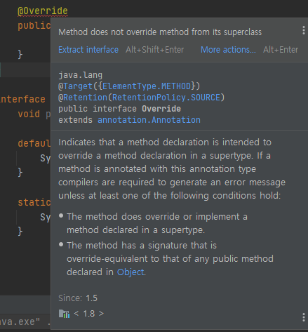

## 인터페이스 정의하는 방법

- 인터페이스란?

  인터페이스는 일종의 추상클래스로, 추상클래스보다 추상화 정도가 높아서 추상클래스와 달리 몸통을 갖춘 일반 메서드 또는 멤버변수를 구성원으로 가질 수 없다. 오직 추상메서드와 상수만을 멤버로 가질 수 있으며, 그 외의 다른 어떠한 요소도 허용하지 않는다.

  보통 인터페이스는 다른 클래스를 작성하는데 도움을 주는 목적으로 작성된다.

- 인터페이스 정의 방법

    ```java
    public interface Number {
    	public static final int NUMBER = 100;
    	public abstract void readNumber(int number);
    }
    ```

  인터페이스를 정의하는 방법은 클래스와 같다. 다만 키워드로 class 대신 interface를 사용한다는 것만 다르다. 그리고 interface에도 클래스와 같이 접근제어자로 public 또는 default를 사용할 수 있다

  일반적인 클래스의 멤버들과 달리 인터페이스의 멤버들은 다음과 같은 제약사항이 있다.

    - 제약사항
        - 모든 멤버변수는 public static final 이어야 하며, 이를 생략할 수 있다.
        - 모든 메서드는 public abstract 이어야 하며, 이를 생략할 수 있다. 단, static 메서드와 디폴트 메서드는 예외이다.

## 인터페이스 구현하는 방법

- 인터페이스 구현

  인터페이스도 추상클래스처럼 그 자체로는 인스턴스를 생성할 수 없으며, 추상클래스가 삭속을 통해 추상메서드를 완성하는 것처럼, 인터페이스도 자신에 정의된 추상메서드의 몸통을 만들어주는 클래스를 작성해야 하는데, 그 방법은 추상클래스가 자신을 상속받는 클래스를 정의하는 것과 다르지 않다. 다만 클래스가 확장한다는 의미와 키워드 'extends'를 사용하지만 인터페이스는 구현한다는 의미의 키워드 'implements'를 사용할 뿐이다.

    ```java
    class Dog implements Eatable {
    		//인터페이스에 정의된 추상메서드를 구현해야 한다.
        @Override
        public void eat() {
            
        }
    }

    interface Eatable {
        void eat();
    }
    ```

  위의 코드를 보면 Dog 클래스가 있다. 위에서 설명했듯 'implements' 키워드를 통해 Eatable이라는 인터페이스를 구현하였다. interface는 강제성이 있어 인터페이스에 정의된 메서드를 모두 구현해야하기 때문에 implements 키워드로 인터페이스를 구현한 클래스는 해당 인터페이스의 추상메서드를 모두 구현해야한다.

  인터페이스의 추상메서드인 eat() 메서드가 정의되어있기 때문에 Dog 클래스에서도 eat() 클래스를 구현하였다.

## 인터페이스 레퍼런스를 통해 구현체를 사용하는 방법

- 인터페이스 타입 변수 선언과 구현

  인터페이스 타입의 변수는 동일한 인터페이스를 구현한 클래스로 객체 선언이 가능하다. 밑의 코드와 함께 보자.

    ```java
    public class Main {
        public static void main(String[] args) {
    				//1.
            Eatable eatable = new Dog();
            Eatable eatable1 = new Cat();
    				//2.
            eatable.eat();
            eatable1.eat();
        }
    }
    //3.
    interface Eatable {
        void eat();
    }
    //4.
    class Dog implements Eatable {
        @Override
        public void eat() {
            System.out.println("멍멍 쩝쩝");
        }
    }
    //5.
    class Cat implements Eatable {
        @Override
        public void eat() {
            System.out.println("냐옹 쩝쩝");
        }
    }

    /*
    	출력결과
    	멍멍 쩝쩝
    	냐옹 쩝쩝

    */
    ```

  3번을 보면, Eatable이라는 이름을 가진 인터페이스를 생성했다. 추상메서드로 void eat() 메서드를 선언했다. 그 밑에 4번, 5번에는 Eatable 인터페이스를 implements한 클래스 Dog, Cat이 있다.

  다시 1번으로 돌아와서 Eatable 타입의 변수에 Eatable 인터페이스를 구현한 클래스로 객체선언을 한 것을 볼 수 있다.

  2번에서는 선언된 객체의 메서드를 호출했는데, 각 클래스에서 선언된 클래스의 메서드의 구현부대로 실행된다. 각각의 추상메서드를 구현한 메서드는 4번, 5번에 있다.

- 인터페이스 타입의 객체를 선언할때의 특징

  말 그대로 선언하려는 변수의 타입이 인터페이스이기 때문에 구현하려는 객체가 해당 인터페이스를 구현하고 있다면 교체가 가능하다. 이는 서로의 의존성을 낮추어 유지보수 에 용이함을 가져다준다.

  위처럼 객체의 교체가 용이한 이유는 인터페이스의 특징인 추상메서드 구현의 강제성 때문이다. 그렇기 때문에 인터페이스를 구현한 클래스가 적어도 두개 이상이라면 보통의 경우 손쉽게 교체가 가능하다.

## 인터페이스 상속

- 인터페이스의 상속

  인터페이스는 인터페이스로부터만 상속받을 수 있으며, 클래스와는 달리 다중상속, 즉 여러개의 인터페이스로부터 상속을 받는 것이 가능하다.

    ```java
    interface Eatable {
        void eat();
    }

    interface Runnable {
        void run();
    }

    interface Fightable extends Eatable, Runnable {
        void attack();
        
    }
    ```

  순서대로 인터페이스를 생성하고, 맨 밑의 인터페이스는 두개의 인터페이스를 상속받도록 설정하였다. 인터페이스를 상속받았다고해서 위의 두개의 인터페이스의 추상메서드를 그대로 작성할 필요는 없다. 어차피 구현할 클래스에서 세개의 인터페이스의 모든 추상클래스를 구현해야만 하는건 마찬가지다.

  즉, Fightable 인터페이스 자체에서는 작성된 추상메서드가 하나지만, 상속받은 두개의 추상메서드를 멤버로 추가적으로 가지게 된다.

## 인터페이스의 기본 메소드 (Default Method), 자바 8

- 자바 8에 새로 추가된 기본 메서드

  자바8 이전에 인터페이스에서는 새로운 메서드를 추가하게 되면 일일이 그 메서드를 구현해야하는 번거로움과 유지보수성이 떨어진다는 단점이 있었다. 그에 대한 대안으로 추상 클래스에 인터페이스를 implement하여 구현하지 않아도 되는 메서드를 만드는 방법을 선택했다. 자바의 특징인 단일 상속을 염두하면 그리 좋은 방안은 아니다.

  그 뒤로 자바 8에서는 인터페이스에 변화가 생겼다 인터페이스의 기본 메서드가 등장하면서 불편함을 해소했다.

- 기본 메서드란?

  기본 메서드란 인터페이스에 메서드 선언이 아닌 구현체를 제공한다. 그러므로 implements한 클래스는 기본 메서드를 구현 할 필요가 없다.

    ```java
    default void defaultMethod() {
    	// 구현부
    }
    ```

  인터페이스에서 위처럼 코드를 입력하면 기존에 implements 한 클래스들은 컴파일 에러를 일으키지 않는다. 해당 인터페이스를 구현한 클래스를 깨뜨리지 않고 새 기능을 추가할 수 있다.

- 기본메서드의 특징
  - 인터페이스를 상속받는 인터페이스에서 다시 추상 메소드로 변경할 수 있다.

      ```java
      interface test1 {
          default void defaultMethod() {
              //구현부
          }
      }

      interface test2 extends test1 {
          void defaultMethod();
      }
      ```

  - 인터페이스 구현체가 재정의 할 수도 있다.

      ```java
      public class Main implements test1 {
          @Override
          public void defaultMethod() {
              //구현부
          }
      }

      interface test1 {
          default void defaultMethod() {
              //구현부
          }
      }
      ```

- 기본 메서드 작성시 주의사항

  기본 메서드는 구현체가 모르게 추가가 되었을 수도 있다. 이유는 인터페이스를 들여다보지 않으면 알 수 없기 때문이다. 이 때문에 없다가 새로 생긴 기본 메서드로 인해 기존에 없던 컴파일 에러를 일으킬 수 있다. 그러므로 반드시 문서화를 통해 알려야한다.

## 인터페이스의 static 메소드, 자바 8

- 인터페이스의 static 메서드란?

  자바 8이 들어오면서 위에서 다뤘던 기본 메서드와 같이 static 메서드도 같이 등장했다. 원래는 인터페이스에 추상 메서드만 선언이 가능했는데, static 또는 기본 메서드도 같이 선언할 수 있게 되었다. static 메서드는 접근제어자가 항상 public이며, 생략이 가능하다.

- static 메서드의 특징

  위에서 다뤘던 기본메서드와 같이 인터페이스 내에서 구현이 가능하다는 특징이 있지만, implements 하는 클래스에서 재정의(Override)가 불가능 하다는 특징이 있다. 이는 기본 메서드와는 구분되는 차이이다.

    ```java
    public class Main implements Foo{

        @Override // 필수 구현
        public void printName(String name) {
            
        }

        @Override // override 가능
        public void printFullName(String firstName, String lastName) {

        }
        
        @Override // 오류
        public static void upperName(String name) {
            
        }
    }

    interface Foo {
        void printName(String name);
        
        default void printFullName(String firstName, String lastName) {
            System.out.println(lastName + " " + firstName);
        }
        
        static void printUpperName(String name) {
            System.out.println(name.toUpperCase());
        }
    }
    ```

  위의 코드를 보면 Main 클래스의 upperName() 메서드는 @Override 에서 빨간 밑줄이 생긴다.

  

  그러므로 static 메서드를 Override하지 않도록 주의해야 한다.

## 인터페이스의 private 메소드, 자바


자료참조

자바의 정석 3rd Edition(남궁 성 저)