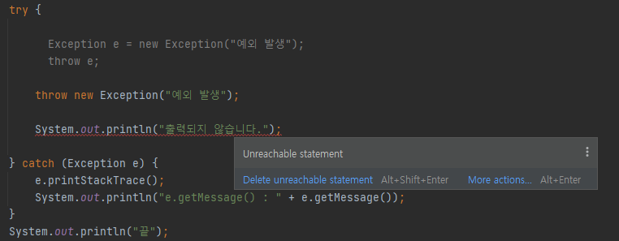

## 자바에서 예외 처리 방법 (try, catch, throw, throws, finally)

- 예외처리란?

  예외처리란 프로그램 실행 시 발생할 수 있는 예기치 못한 예외의 발생에 대비한 코드를 작성하는 것으로, 예외처리의 목적은 예외의 발생으로 인한 실행 중인 프로그램의 갑작스런 비정상 종료를 막고, 정상적인 실행상태를 유지할 수 있도록 하는 것이다.

- try-catch

  try 블럭에는 여러 종류의 예외를 처리할 수 있도록 하나 이상의 catch 블럭이 올 수 있으며, 이 중 발생한 예외의 종류와 일치하는 단 한 개의 catch 블럭만 수행된다. 발생한 예외의 종류와 일치하는 catch 블럭이 없으면 예외는 처리되지 않는다.

    ```java
    try {
        String str = null;
        System.out.println(str.length());

        System.out.println("낯이 익지도 않았지만");
        System.out.println("같이 마치 달콤한 연인같이 하나 되는 우릴 봤지");

    } catch(NullPointerException e) {
        e.printStackTrace();
    }

    System.out.println("너를 원해 이말 전해");
    System.out.println("나를 너무도 원하는 너만의 눈빛이 내눈에 정말 너무 훤해");

    /*
    	--출력결과--
    	java.lang.NullPointerException
    		at Main.main
    	너를 원해 이말 전해
    	나를 너무도 원하는 너만의 눈빛이 내눈에 정말 너무 훤해
    */
    ```

  try문 안에서 예외가 발생하면 예외가 발생한 구문 아래에서부터 catch문 사이의 코드는 실행되지 않는다. 바로 catch문으로 넘어가 설계된 코드를 실행하고 try-catch문을 종료한다.

  위의 코드는 try-catch문이 어떻게 실행되는지에 대해 설계한 코드이다. 의도적으로 NPE를 호출하는 코드를 작성하고 그 밑에 출력문을 작성하였다.

  출력결과는 NPE가 발생된 코드에서 밑의 System.out.println()의 내용을 출력하지 않고 catch문으로 넘어가 로직을 처리하고 try-catch문이 종료되었다. 그 뒤에 나오는 System.out.println() 두 라인이 출력된 결과를 확인할 수 있다.

  여기서 중요한 점은, catch블럭의 인자 부분에서 try블럭 안에 해당하는 예외가 일치하는지를 확인해야한다. 그렇지않으면 예외처리는 실행되지않는다.

    ```java
    try {
      String str = null;
      System.out.println(str.length());

      System.out.println("낯이 익지도 않았지만");
      System.out.println("같이 마치 달콤한 연인같이 하나 되는 우릴 봤지");

    } catch(NumberFormatException e) {
      e.printStackTrace();
    }

    System.out.println("너를 원해 이말 전해");
    System.out.println("나를 너무도 원하는 너만의 눈빛이 내눈에 정말 너무 훤해");

    /*
    	--출력결과--
    	Exception in thread "main" java.lang.NullPointerException
    		at Main.main
    */
    ```

  위의 try 블럭에서는 NPE를 유도하는 코드를 작성했고, catch 블럭에서는 NFE를 설정하였다. 그렇기 때문에 try-catch문을 사용하여도 예외처리는 이루어지지 않았음을 알 수 있다.

    ```java
    public static void main(String[] args) {
        try {
            String str = "Hi!";
            System.out.println(str);

            System.out.println("낯이 익지도 않았지만");
            System.out.println("같이 마치 달콤한 연인같이 하나 되는 우릴 봤지");

        } catch(NumberFormatException e) {
            e.printStackTrace();
        }

        System.out.println("너를 원해 이말 전해");
        System.out.println("나를 너무도 원하는 너만의 눈빛이 내눈에 정말 너무 훤해");
    }

    /*
    	Hi!
    	낯이 익지도 않았지만
    	같이 마치 달콤한 연인같이 하나 되는 우릴 봤지
    	너를 원해 이말 전해
    	나를 너무도 원하는 너만의 눈빛이 내눈에 정말 너무 훤해
    */
    ```

  당연히 예외가 발생하지 않으면 try 블럭만 실행되고, catch 블럭은 실행되지 않고 건너간다.

  위의 내용을 정리하자면,

    - try 블럭 내에 예외가 발생한 경우
        - 발생한 예외와 일치하는 catch 블럭이 있는지 확인한다.
        - 일치하는 catch 블럭을 찾게 되면, 그 catch 블럭 내의 문장들을 수행하고 전체 try-catch문을 빠져나가서 그 다음 문장을 계속해서 수행한다. 만일 일치하는 catch문을 찾지 못하면, 그 예외는 처리되지 못한다.
    - try 블럭 내에 예외가 발생하지 않은 경우
        - catch 블럭을 거치지 않고 전체 try-catch문을 빠져나가 수행을 계속한다.
- throw

  throw를 이용하여 예외를 발생시킬 수 있다.

    ```java
    public static void main(String[] args) {
    	try {
    	
    	//Exception e = new Exception("예외 발생");
    	//throw e;
    	
    		throw new Exception("예외 발생");
    	
    	} catch (Exception e) {
    		e.printStackTrace();
    		System.out.println("e.getMessage() : " + e.getMessage());
    	}
    	System.out.println("끝");
    }

    /*
      --출력결과--
    	java.lang.Exception: 예외 발생
    		at Main.main()
    	e.getMessage() : 예외 발생
    	끝
    */
    ```

  위는 throw키워드를 이용하여 의도적으로 예외를 발생시켰다. throw를 이용하면 throw 키워드 밑에는 코드를 입력할 수 없다. 이유는 throw 키워드를 사용하면 예외가 발생하기 때문에 소용이 없기 때문이다.

  

  위의 사진 그대로 System.out.print()는 도달할 수 없다.

  또한 throw 키워드를 사용하면 반드시 try-catch 또는 throws 예외처리를 해야한다. 그렇지 않으면 컴파일조차 되지 않는다.

- throws

  예외를 처리하는 방법 중 메서드에 예외를 선언하는 방법이 있다. 메서드에 예외를 선언하려면 메서드 선언부에 throws 키워드를 사용하면 된다. 적게는 한개에서 여러개 사용이 가능하다.

    ```java
    public static void main(String[] args) throws NullPointerException, NumberFormatException {
            //
    }
    ```

  두개 이상부터는 쉼표로 구분하면 된다.

- finally

  try-catch문의 끝에 선택적으로 덧붙여 사용할 수 있으며, 예외의 발생여부에 상관없이 실행되어야 할 코드를 포함시킬 목적으로 사용된다. 순서는 try-catch-finally이다.

    ```java
    public static void main(String[] args) {

        try {
            System.out.println("start.");
            
            String str = null;
            System.out.println(str.length());
            
        } catch(Exception e) {
            e.printStackTrace();
        } finally {
            System.out.println("end");
        }

    }

    /*
      --출력결과--
    	start.
    	java.lang.NullPointerException
    		at Main.main()
    	end
    */
    ```

  입력 순서와 마찬가지로 실행 순서도 try-catch-finally이다. 만약 try 블럭 내에 예외사항이 없다면 try-finally 순서로 실행될 것이다.

  만약 try 블럭 내에 return 키워드를 실행시켜도 finally 블럭 내의 코드들은 수행된다.

## 자바가 제공하는 예외 계층 구조

자바에서는 실행 시 발생할 수 있는 오류를 클래스로 정의하였다. 모든 예외의 최고 조상은 Exception 클래스이며, 아래는 예외클래스 계층도이다.


사진 출처 : [http://www.tcpschool.com/java/java_exception_class](http://www.tcpschool.com/java/java_exception_class)

위의 사진자료에서 왼쪽은 Error, 오른쪽은 이번 주제에서 다룰 예외이다. 모든 클래스의 조상은 Object이며, 에러와 예외를 자식클래스로 두는 Throwable 클래스도 있다.

위의 구조에서 볼 수 있듯, 예외 클래스들은 다음와 같이 두 그룹으로 나뉠 수 있다.

## RuntimeException과 RE가 아닌 것의 차이는?

RuntimeException을 상속하는 클래스를 Unchecked Exception, 반대로 상속하지 않는 클래스를 Checked Exception이라고도 한다.

1. Exception 클래스와 그 자손들
  - 사용자의 실수와 같은 외적인 요인에 의해 발생하는 예외로, 존재하지 않는 파일 이름을 입력한 경우(FileNotFoundException)와 클래스 이름을 잘 못 적은 경우(ClassNotFoundException) 등의 경우에 해당한다.
  - 반드시 예외 처리해야하며, 컴파일 시점에 발생한다.

2. RuntimeException 클래스와 그 자손들
  - 프로그래머의 실수로 발생하는 예외로, 배열의 범위를 벗어나는 경우(ArrayIndexOutOfBoundsException)와  널 값을 참조한 경우(NullPointerException) 등의 경우에 해당한다.
  - 명시적으로 하지 않아도 되며, 런타임 시점에 발생한다.

## Exception과 Error의 차이는?

- 예외의 특징

  예외는 발생할 상황을 미리 예측하여 처리할 수 있으며, 적절한 예외 처리를 통해 정상 실행 상태가 유지될 수 있도록 프로그램을 종료시키지 않게 한다.

- 에러의 특징

  에러는 시스템에 비정상적인 상황이 생겼을 때 발생한다. 이는 시스템 레벨에서 발생하기 때문에 개발자가 미리 예측하여 처리할수 없다.

- 둘의 차이
  - 오류는 JVM에서 발생되어 처리가 불가능하지만 예외는 예외 처리를 통해 종료시키지 않을 수 있다.
  - 오류는 대비가 불가능하지만 예외는 대비가 가능하다

## 커스텀한 예외 만드는 방법


자료참조

자바의 정석 3rd Edition(남궁 성 저)

[https://dololak.tistory.com/53](https://dololak.tistory.com/53)

[https://www.nextree.co.kr/p3239/](https://www.nextree.co.kr/p3239/)

[https://madplay.github.io/post/java-checked-unchecked-exceptions](https://madplay.github.io/post/java-checked-unchecked-exceptions)