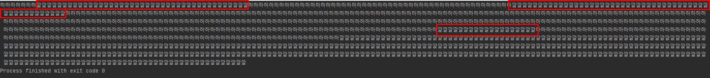
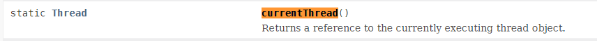
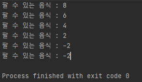
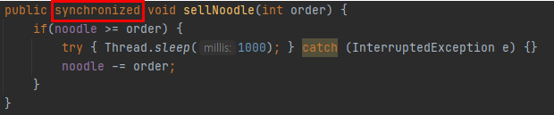
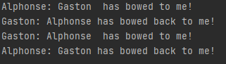

## Thread 클래스와 Runnable 인터페이스

쓰레드를 구현하는 방법은 Thread 클래스를 상속받는 방법과 Runnable 인터페이스를 구현하는 방법 총 두가지가 있다. 자바의 특징중 하나인 단일상속이라는 특징을 염두하면 클래스를 상속받는 방법보단 Runnable 인터페이스를 구현하는 방법이 일반적이라 볼 수 있다.

Runnable은 말 그대로 인터페이스이기 때문에 인터페이스의 특징인 일관성과 재사용성이라는 부분을 보면 Runnable 인터페이스를 사용하는 것은 객체지향적인 방법이라 생각한다.

- Thread Class

    ```java
    class MyThread extends Thread {
    	public void run() {
    		//...
    	}
    }

    class Main {
    	public static void main(String[] args) {
    		MyThread thread = new MyThread();
    		thread.start();
    	}
    }
    ```

- Runnable Interface

    ```java
    class MyThread implements Runnable {
    	public void run() {
    		//...
    	}
    }

    class Main {
    	public static void main(String[] args) {
    		Thread thread = new Thread(new MyThread());
    		thread.start();
    	}
    }
    ```

  Runnable 인터페이스로 구현한 경우와 Thread 클래스로 구현한 경우의 객체 선언 방법이 다르다. Runnable 인터페이스의 구현 경우,  좌항에서는 Thread 타입의 변수 thread를, 우항에서는 새로운 생성자에 Runnable 인터페이스를 구현한 MyThread 클래스를 매개변수로 선언했다. 위처럼 매개변수에 MyThread클래스를 담으면 상속을 통해 run()을 오버라이딩 하지 않고도 외부로부터 run() 메서드를 제공받을 수 있게 된다.

- start(), run()

  쓰레드를 실행시킬 때 run() 메서드가 아닌 start()메서드를 호출해야한다. 그 이유는 run()메서드는 그저 클래스에 선언된 메서드를 호출하기 때문에 쓰레드의 스케줄링과 관련된 메서드를 실행시켜도 원하는대로 동작하지 않을 가능성이 있다.

    ```java
    public class Main {
        public static void main(String[] args) throws IOException {

            Thread thread1 = new Thread(new MyThread1());
            thread1.run();
            thread1.run();
            thread1.run();
        }
    }

    class MyThread1 implements Runnable {
        @Override
        public void run() {
            System.out.println(Thread.currentThread().getName());
        }
    }

    /*
    	출력결과
    	main
    	main
    	main

    */
    ```

  위는 main 메서드에서 thread1.run() 메서드를 실행시켰을 때의 실행결과이다. 실행되는 쓰레드의 이름이 모두 같은 main 쓰레드이다. 이는 새로운 call stack 을 할당받지 않고 말 그대로 main 쓰레드에서 run()메서드가 실행된 것 뿐이다.

  반면에 start() 메서드는 새로운 쓰레드가 작업을 실행하는데에 필요한 call stack을 생성한 다음 run() 메서드를 호출해서, 생성된 call stack에 run()메서드가 첫 번째로 올라가게 한다. 이는 쓰레드에게 독립적인 작업을 수행하기 위해 자신만의 call stack을 필요로 하기 때문에, 새로운 쓰레드를 생성하고 실행시킬 대마다 새로운 call stack이 생성되고, 쓰레드가 종료되면 작업에 사용된 call stack은 소멸된다.

    ```java
    public class Main {
        public static void main(String[] args) throws IOException {

            Thread thread1 = new Thread(new MyThread1());
            thread1.start();
        }
    }

    class MyThread1 implements Runnable {
        @Override
        public void run() {
            System.out.println(Thread.currentThread().getName());
        }
    }

    /*
    	출력결과
    	Thread-0
    */
    ```

  위의 출력결과를 통해 새로운 call stack을 생성하고 그 뒤에 run() 메서드를 호출한 것을 확인할 수 있다.

  그리고 한 가지 알아야 하는 게, 한번 실행이 종료가 된 쓰레드는 다시 실행할 수 없다. 즉, start()메서드는 단 한번만 호출이 가능하다. 만약 두번 이상 호출하게 되면 IllegalThreadStateException예외가 호출된다.

  당연히 run() 메서드는 여러번 호출해도 문제가 없다. 이유는 말 그대로 클래스의 메서드만 호출되었기 때문이다.

## 쓰레드의 상태

- 쓰레드의 상태

  아래는 쓰래드의 생성부터 소멸까지의 과정을 다섯가지로 분류하였다. 아래는 다섯가지 상태의 간략한 특징들을 나열해보았다.

  추가로, 쓰레드의 상태를 확인하고 싶다면, Thread의 getState() 메서드를 통해 확인이 가능하다.
  
  |상태|설명|
  |:---|:---|
  |NEW(생성)|쓰레드가 생성되고 아직 start()가 호출되지 않은 상태|
  |RUNNABLE(실행 대기)|실행 중 또는 실행 가능한 상태|
  |BLOCKED(일시정지)|동기화블럭에 의해서 일시정지된 상태(lock이 풀릴 때까지 기다리는 상태)|
  |WAITING<br/> TIMED_WAITING(일시정지)|쓰레드의 작업이 종료되지는 않았지만 실행가능하지 않은(unrunnable) 일시정지 상태. TIME_WAITING은 일시정지시간이 지정된 경우를 의미한다.|
  |TERMINATED(소멸)|쓰레드의 작업이 종료된 상태|


- 쓰레드의 상태 제어 메서드

  쓰레드 프로그래밍이 어려운 이유는 동기화와 상태를 제어하는 일이 까다롭기 때문이다. 효율적으로 쓰레드를 관리하기 위해서 쓰레드의 상태를 제어하는 것이 중요한데, 상태를 제어하는 메서드에 대해 알아보자
  
  |메서드|설명|
  |:---|:---|
  |static void sleep(long millis)<br/> static void sleep(long millis, int nanos)|지정된 시간(천분의 일초 단위)동안 쓰레드를 일시정지시킨다. 지정한 시간이 지나고 나면, 자동적으로 다시 실행대기상태가 된다.|
  |void join()<br/> void join(long millis)<br/> void join(long millis, int nanos)|지정된 시간동안 쓰레드가 실행되도록 한다. 지정된 시간이 지나거나 작업이 종료되면 join()메서드를 호출한 쓰레드로 다시 돌아와 실행을 계속한다.|
  |void interrupt()|sleep(), join()에 의해 일시정지상태인 쓰레드를 깨워서 실행대기상태로 만든다. 해당 쓰레드에서는 InterruptedException이 발생함으로써 일시정지상태를 벗어나게 된다.|
  |void stop()|쓰레드를 즉시 종료시킨다.|
  |void suspend()|쓰레드를 일시정지시킨다. resume()메서드를 호출하면 다시 실행대기상태가 된다.|
  |void resume()|suspend()에 의해 일시정지상태에 있는 쓰레드를 실행대기상태로 만든다.|
  |static void yield()|실행 중에 자신에게 주어진 실행시간을 다른 쓰레드에게 양보(yield)하고, 자신을 실행대기상태가 된다.|

- 쓰레드의 생성부터 소멸까지의 과정

  과정을 담고 있지만, 반드시 과정대로 쓰레드가 수행되진 않는다.

   
  
  *위의 사진은 아래의 글을 참고하며 볼때 이해하기 쉽도록 첨부한 자료입니다.*
  
  1. NEW

     쓰레드를 생성하고 start() 메서드를 호출하면 바로 실행되는 것이 아니라, 실행대기열에 저장되어 자신의 차례가 될 때까지 기다려야한다. 실행대기열은 큐(queue) 구조로 되어있어, 순서대로 쓰레드가 실행된다.

  2. RUNNABLE

     실행대기상태에 있다가 자신의 차례가 되면 실행상태가 된다. 만약 주어진 실행시간이 다 되거나 yield() 메서드를 만난다면 다시 실행 대기 상태가 되고, 다음 차례의 쓰레드가 실행된다.

  3. WAITING, BLOCKED

     실행 중 suspend(), sleep(), wait(), join(), I/O block에 의해 일시정지상태가 될 수 있다. (I/O block은 입출력 작업에서 발생되는 지연상태를 의미한다. 일례로, 사용자의 입력대기상태로 예시를 들 수 있는데, 입력을 마치면 실행대기상태가 된다.)

     지정된 일시정지시간이 다 되거나(time-out), notify(), resume(), interrupt() 메서드가 호출되면 일시정지상태를 벗어나 다시 실행대기열에 저장되어 자신의 차례를 기다리게 된다.

  4. TERMINATED

     실행을 모두 마치거나 stop() 메서드가 호출되면 쓰레드는 소멸된다.
  
- 예제

    ```java
    public class Main extends Thread {
        public static void main(String[] args) {
            Thread thread2 = new Thread(new MyThread2());
            thread2.start();
        }
    }

    class MyThread1 implements Runnable {
        @Override
        public void run() {
            for(long i=0; i<1000000000; i++) {} // 2. RUNNABLE

            try {
                Thread.sleep(1500);  // 3. TIMED_WAITING
            } catch(Exception e) {}

            for(long i=0; i<1000000000; i++) {} // 2. RUNNABLE
        } // 4. TERMINATED
    }

    class MyThread2 implements Runnable {

        Thread thread1 = new Thread(new MyThread1()); // 1.NEW

        @Override
        public void run () {
            while (true) {
                Thread.State state = thread1.getState();
                System.out.println(state);
                if (state == Thread.State.NEW) {
                    thread1.start();
                }
                if (state == Thread.State.TERMINATED) {
                    break;
                }
                try {
                    Thread.sleep(500);
                } catch (Exception e) {}
            }
        }
    }

    /*
    	출력결과

    	NEW
    	RUNNABLE
    	RUNNABLE
    	TIMED_WAITING
    	TIMED_WAITING
    	TIMED_WAITING
    	RUNNABLE
    	TERMINATED
    */
    ```

  위는 두개의 쓰레드로 하나는 쓰레드의 진행을, 또 다른 하나는 진행중인 쓰레드의 상태를 반환하는 구성이다. MyThread1은 쓰레드의 상태를 확인하기위해 구동되는 로직이고, MyThread2는 MyThread1이 구동될때마다의 상태를 0.5초마다 한번씩 출력하도록 설정하였다.

  1번을 보면, MyThread2에서 첫번 째 객체를 선언할 때 NEW, 2번은 쓰레드가 진행중 또는 실행 대기상태 RUNNABLE를, 3번은 잠시 멈추어있을 때 TIMED_WAITING, 4번마지막 메서드가 끝나면 비로소 TERMINATED를 반환한다

## 쓰레드의 우선순위

쓰레드는 우선순위라는 속성을 가지고 있는데, 이 우선순위에 값에 따라 쓰레드가 얻는 실행시간이 달라진다. 쓰레드가 수행하는 작업의 중요도에 따라 쓰레드의 우선순위를 서로 다르게 지정하여 특정 쓰레드가 더 많은 작업시간을 갖도록 할 수 있다.

- 쓰레드의 우선순위 지정

    ```java
    void setPriority(int newPriority) //쓰레드 우선순위 설정
    int getPriority() //쓰레드 우선순위 반환

    public static final int MAX_PRIORITY = 10 //최대 우선순위
    public static final int MIN_PRIORITY = 1 //최소 우선순위
    public static final int NORM_PRIORITY = 5 //보통 우선순위
    ```

  쓰레드가 가질 수 있는 우선순위의 범위는 1~10이며 숫자가 높을수록 우선순위가 높다. 한 가지 더 알아두어야 할 것은 쓰레드의 우선순위는 쓰레드를 생성한 쓰레드로부터 상속받는다는 것이다. main메서드를 수행하는 쓰레드는 우선순위가 5이므로 main메서드 내에서 생성하는 쓰레드의 우선순위는 자동적으로 5가된다.

    ```java
    public class Main {
        public static void main(String[] args) throws IOException {

            Thread thread1 = new Thread(new MyThread1());
            Thread thread2 = new Thread(new MyThread2());

            thread1.setPriority(7);

            thread1.start();
            thread2.start();
        }
    }

    class MyThread1 implements Runnable {
        @Override
        public void run() {
            int num = 500;
            while(num-- > 0) {
                System.out.print("하");
            }
        }
    }

    class MyThread2 implements Runnable {
        @Override
        public void run() {
            int num = 500;
            while(num-- > 0) {
                System.out.print("깔");
            }
        }
    }
    ```

  위 예제 코드는 두개의 쓰레드 객체를 생성했다. thread1에 setPriority()메서드를 이용하여 기본 우선순위인 5보다 더 큰 7로 설정하고. 실행해보았다. 아래는 예제를 실행한 결과이다.

  

  여러 번 실행했으나 전체적인 실행 결과는 비슷했다. 우선순위가 낮은 쓰레드가 마지막에 출력되는 형태는 동일했으나 중간중간 순서가 살짝씩 바뀌는것은 실행할 때마다 달랐다.

  위의 결과로 알 수 있는 사실은 우선순위가 높은 쓰레드에게 더 많은 시간을 할당해준 다는 것이다. 그러므로 우선순위가 높은 쓰레드는 더 일찍 로직을 끝마칠 수 있다.

  하지만 싱글코어의 기준에서 쓰레드에 우선순위를 부여하는게 의미가 있지만, 멀티코어의 기준에서는 다르다.  게다가 멀티코어는 OS마다 실행하는 기준이 다르기 때문에 직접 쓰레드의 우선순위를 부여하는것은 큰 의미가 없다.그러므로 쓰레드에 우선순위를 부여하는 것 대신 작업에 우선순위를 두어 PriorityQueue에 담아놓고, 우선순위가 높은 작업이 먼저 처리되도록 하는 것이 더 확실한 방법이라 할 수 있다.

## Main 쓰레드

메인 메서드(public static void main(String[] args))의 작업을 수행하는 것도 쓰레드이며, 이를 메인 쓰레드라고 한다. 여태 실행을 위해 메인메서드를 실행시켰다면 메인 쓰레드에 의해 쓰레드가 실행됐던 것이다. 덧붙여, 기본적으로 프로그램이 실행되기 위해서는 작업을 수행하는 하나의 쓰레드를 생성하고, 그 쓰레드가 메인 메서드를 호출하여 작업이 수행되도록 하는 것이다.

물론 메인 메서드가 수행을 마치면 프로그램이 종료되지만, 메인 메서드가 수행을 마쳤다 하더라도 다른 스레드가 아직 작업을 마치지 않은 상태라면 프로그램은 종료되지 않는다.

아래는 쓰레드의 흐름을 한눈에 파악할 수 있는 flow diagram이다.


자료 출처 : [https://www.geeksforgeeks.org/main-thread-java/](https://www.geeksforgeeks.org/main-thread-java/)

- Thread.currentThread()

    ```java
    public class Main {
        public static void main(String[] args) {
            Thread r = Thread.currentThread();
            System.out.println(r.getName());
        }
    }

    /*
    	출력결과
    	main
    	
    	Process finished with exit code 0
    */
    ```

  현재 실행되는 쓰레드를 확인하고 싶을 때 Thread.currentThtread() 메서드를 이용하여 객체를 선언할 수 있고, 그 객체를 통해 현재 쓰레드의 정보를 알 수 있다.

  

  자료 출처 : [https://docs.oracle.com/javase/8/docs/api/](https://docs.oracle.com/javase/8/docs/api/)

  덧붙여 설명하자면, 위의 설명에도 알 수 있듯 현재 실행하는 쓰레드 객체 참조를 반환한다.

  다시 돌아와서, 위의 출력결과를 통해 메인쓰레드임을 확인할 수 있다.

- 메인메서드가 종료되고나서도 실행되는 메서드

    ```java
    public class Main {
        public static void main(String[] args) {
            MyThread1 thread1 = new MyThread1();        
            thread1.start();
        }
    }

    class MyThread1 extends Thread {
        @Override
        public void run() {
            exception();
        }

        void exception() {
            try {
                throw new Exception();
            } catch (Exception e) {
                e.printStackTrace();
            }
        }
    }

    /*
    	출력결과
    	java.lang.Exception
    		at MyThread2.exception(Main.java:20)
    		at MyThread2.run(Main.java:15)
    		at java.lang.Thread.run(Thread.java:748)
    	
    	Process finished with exit code 0
    */
    ```

  위의 코드는 새로 생성한 쓰레드에서 고의적으로 예외를 실행시키도록 설정하였다. 출력결과를 보면 printStackTrace()에 의해 호출스택을 확인할수 있다. 예외가 발생한 당시의 호출스택을 보면 모두 새로 생성한 쓰레드에서 발생한 예외임을 알 수 있다.

  이를 통해 알 수 있는 사실은 호출스택에 메인 메서드가 없었다는 것이고, 이는 메인메서드에서 따로 호출스택을 생성하였다는 것을 알 수 있다.

- 호출 스택이 따로 생성되지 않은 경우

    ```java
    public class Main {
        public static void main(String[] args) {
            Thread thread2 = new Thread(new MyThread2());
            thread2.run(); // 위의 코드와 다르게 이번에는 run() 메서드로 설정하였다.
        }
    }

    class MyThread2 implements Runnable {
        @Override
        public void run() {
            exception();
        }

        void exception() {
            try {
                throw new Exception();
            } catch (Exception e) {
                e.printStackTrace();
            }
        }
    }

    /*
    	출력결과
    	java.lang.Exception
    		at MyThread2.exception(Main.java:16)
    		at MyThread2.run(Main.java:11)
    		at java.lang.Thread.run(Thread.java:748)
    		at Main.main(Main.java:4)
    	
    	Process finished with exit code 0
    */
    ```

  위의 코드는 start() 메서드와 run() 메서드의 차이로 발생하는 출력결과를 확인할 수 있다. run()메서드는 단순히 실행만 할 뿐 따로 호출스택을 생성하지 않기 때문에 메인 쓰레드에서 실행됐음을 출력결과에서 확인할 수 있다.
## 동기화

멀티쓰레드에서 여러 쓰레드가 같은 프로세스의 자원을 공유하여 작업하다보면 작업을 마쳤을 때 의도했던 것과 다른 결과를 얻을 수 있다. 밑의 예시를 통해 알아보자.

```java
public class Main {
    public static void main(String[] args) {
        Runnable myThread1 = new MyThread1();
        new Thread(myThread1).start();
        new Thread(myThread1).start();
    }
}

class NoodleStore {
    //음식집에서 팔 수 있는 면음식의 갯수
    private int noodle = 10;

    public int getNoodle() {
        return noodle;
    }

    public void sellNoodle(int order) {
        if(noodle >= order) {
            try { Thread.sleep(1000); } catch (InterruptedException e) {}
            noodle -= order;
        }
    }
}

class MyThread1 implements Runnable {

    NoodleStore foodStore = new NoodleStore();
    @Override
    public void run() {
        while(foodStore.getNoodle() > 0) {
            int order = 2;
            foodStore.sellNoodle(order);
            System.out.println("팔 수 있는 음식 : " + foodStore.getNoodle());
        }
    }
}
```

위는 면음식을 파는 음식집을 예시로 구성해보았다. 팔 수 있는 음식은 열 그릇으로 지정해놓고 주문당 두 그릇씩 주문이 들어가도록 설정하였다. 만약 여러 쓰레드가 공유하면서 주문을 하게 된다면,



위의 출력결과로 -2그릇이 주문이 되는 경우가 발생한다.  이러한 오류를 방지하기 위해 한 쓰레드가 진행 중인 작업을 다른 쓰레드가 간섭하지 못하도록 막아야한다. 그러기 위해서는 동기화가 필요하다.

동기화는 진행중인 쓰레드의 작업을 다른쓰레드가 개입하지 못하도록 막는 것을 뜻한다. 보통은 synchronize 키워드를 통해 동기화를 설정한다.



위의 NoodleStore 클래스에 sellNoodle() 메서드이다. 동기화를 설정하려면 메서드 선언부에 synchronize 키워드를 붙이면 된다. 메서드 전체를 지정하는 경우 외에 특정 영역을 지정하는 방법도 있다.

```java
public void sellNoodle(int order) {
    synchronized (this) {
        if(noodle >= order) {
            try { Thread.sleep(1000); } catch (InterruptedException e) {}
            noodle -= order;
        }
    }
}
```

위처럼 메서드가 아닌 특정영역을 동기화하는 경우가 있다. 위의 경우와 방금 설명한 경우, 총 두가지 방식이다.

## 데드락

데드락은 둘 이상의 쓰레드가 서로를 기다리면서 계속 블락이 되는 것을 뜻한다. 다시말해 서로가 lock을 얻기위해 기다리고 있는데, lock을 잡고 있는 쓰레드도 똑같이 다른 lock을 기다리며 서로 블록 상태에 놓이는 것을 뜻한다


자료 출처 : [https://www.geeksforgeeks.org/deadlock-in-java-multithreading/](https://www.geeksforgeeks.org/deadlock-in-java-multithreading/)

위의 자료처럼 서로 각자 자원에 lock을 가지고 있는 상태에서 다른 자원의 lock을 얻기 위해 접근 하다가 교착상태(deadlock)에 빠지게 된다.

```java
public class Deadlock {
    static class Friend {
        private final String name;
        public Friend(String name) {
            this.name = name;
        }
        public String getName() {
            return this.name;
        }
        public synchronized void bow(Friend bower) {
            System.out.format("%s: %s"
                + "  has bowed to me!%n", 
                this.name, bower.getName());
            bower.bowBack(this);
        }
        public synchronized void bowBack(Friend bower) {
            System.out.format("%s: %s"
                + " has bowed back to me!%n",
                this.name, bower.getName());
        }
    }

    public static void main(String[] args) {
        final Friend alphonse =
            new Friend("Alphonse");
        final Friend gaston =
            new Friend("Gaston");
        new Thread(new Runnable() {
            public void run() { alphonse.bow(gaston); }
        }).start();
        new Thread(new Runnable() {
            public void run() { gaston.bow(alphonse); }
        }).start();
    }
}

/*
	출력결과
	Alphonse: Gaston  has bowed to me!
	Gaston: Alphonse  has bowed to me!
*/
```

위의 두 친구는 인사를 하는데 인사에 규칙이 있다. 누군가가 상대방에게 인사를 할 때 상대방이 인사를 할때까지 인사를 해야한다. 그렇다면, A가 B에게 인사를 하면 반대로 B도 A에게 인사를 하는 구조이다. 하지만 서로 같이 인사를 하게된다면 계속 서로가 인사를하고있는 모습이 연출된다.



원래라면 위와같은 출력결과가 나와야한다. 위의 예시는 오라클 공식홈페이지에서 가져왔지만 살짝 억지의 느낌이 있어 바로 이해가 되진 않았지만 위의 그림자료와 같이 교착상태에 빠진것이다. 서로 각자의 행위를 하고 있고, 그 행위에서 다른행위로 서로 넘어가려는 행동 때문에 교착상태가 일어나게 된 것이다.

자료참조

자바의 정석 3rd Edition(남궁 성 저)

[https://codingdog.tistory.com/entry/java-thread-start-vs-run-어떤-차이가-있을까요](https://codingdog.tistory.com/entry/java-thread-start-vs-run-%EC%96%B4%EB%96%A4-%EC%B0%A8%EC%9D%B4%EA%B0%80-%EC%9E%88%EC%9D%84%EA%B9%8C%EC%9A%94)

[https://widevery.tistory.com/27](https://widevery.tistory.com/27)

[https://m.blog.naver.com/PostView.nhn?blogId=qbxlvnf11&logNo=220921178603&proxyReferer=https:%2F%2Fwww.google.com%2F](https://m.blog.naver.com/PostView.nhn?blogId=qbxlvnf11&logNo=220921178603&proxyReferer=https:%2F%2Fwww.google.com%2F)

[https://www.geeksforgeeks.org/main-thread-java/](https://www.geeksforgeeks.org/main-thread-java/)tps://www.geeksforgeeks.org/main-thread-java/)