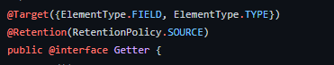

## 애노테이션 정의하는 방법

- 애노테이션 정의

  애노테이션을 정의하는 법에 대해 알아보자. 먼저 밑의 예시와 함께 설명하려 한다.

    ```java

    @Retention(RetentionPolicy.RUNTIME)
    @interface Introduce {
        String name() default "user";
        int age() default 0;
    }
    ```

  애노테이션을 정의하는 방법은 위를 보면 알 수 있듯 '@interface 애노테이션 이름 {}'과 같이 정의할 수 있다.

    ```java
    @interface 애노테이션 {
    	
    }
    ```

  구현부를 보면 '타입 이름()'과 같은 형태로 선언되어있는 것을 확인 할 수 있다. 이를 애노테이션의 요소(element)라고 하며, 위의 예시에는 총 두 가지(String name(), int age())로 선언되어있다. 또한 배열로도 선언이 가능하다

    ```java
    @interface 애노테이션 {
    	타입[] 이름();
    	enum 이름();
    }
    ```

  요소를 선언 한 다음의 키워드 'default'는 기본값으로, 기본값이 있는 요소는 애노테이션을 적용할 때 값을 지정하지 않으면 기본값이 사용된다.

    ```java
    @interface 애노테이션 {
    	//타입 이름() default 타입에 맞는 값
    	int age() default 20;
    }
    ```

  바로 위의 예시에서는 기본값을 20으로 지정한 요소이다.

  이외에 애노테이션 요소를 선언할 때 주의사항에 대해 조금 더 알아보자

    - 요소의 타입은 기본형, String, enum, 애노테이션, Class만 허용된다.
    - () 안에 매개변수를 선언할 수 없다.
    - 예외를 선언할 수 없다.
    - 요소를 타입 매개변수로 정의할 수 없다.
    - 애노테이션은 상속이 허용되지 않는다.

      아래는 주의사항을 코드로 나열한 것이다.

        ```java
        @interface precautions extends Annotation{ // 상속이 허용 안됨.
        	EnumSet set() //에러. 기본형, String, enum, 애노테이션, Class 이외의 것이 타입으로 들어감
        	String add(int number1, int number2) // 에러. 매개변수 선언됐음.
        	String devide() throws ArithmeticException; //에러. 예외 선언 안됨.
        	ArrayList<T> list() //에러. 타입 매개변수 정의됨.
        }
        ```

  마지막으로 @Retention은 밑의 소주제에서 따로 다룰 것이다.

- 애노테이션 출력

  다음은 메인 메서드 안에서 어떻게 애노테이션을 정의했는지 알아보려한다.

    ```java
    import java.lang.annotation.Retention;
    import java.lang.annotation.RetentionPolicy;

    @Introduce(name = "Kimbob", age = 20)
    public class Test {
        public static void main(String[] args) {
            Class<Test> testClass = Test.class;
            Introduce intro = (Introduce)testClass.getAnnotation(Introduce.class);

            System.out.println(intro.name());
        }
    }

    /*
    	출력결과
    	Kimbob
    */
    ```

  클래스 위쪽을 보면 맨 처음에 정의한 애노테이션 'Introduce'를 볼 수 있고, 괄호 안에는 요소의 값을 지정하고 있다. 'Test.class'는 클래스 객체를 의미하는 리터럴이다. 클래스에 대한 정보가 담긴 객체를 생성하는데 이 객체를 클래스 객체라고 한다. 갑자기 쌩뚱맞게 클래스 객체에 대해 설명하는가 라고 의문할 수 있겠지만, 클래스 객체에서는 애노테이션에 대한 정보가 포함되어있기 때문에 앞서 잠시 설명한 것이다. 살짝 더 덧붙이자면, 클래스 객체에는 해당 클래스에 대한 모든 정보를 가지고있다.

  위의 클래스 객체에 대해 알았다면, 클래스 객체로 하여금 getAnnotation()이라는 메서드가 코드의 흐름상 어떠한 기능일지에 대해 감을 잡을 것이다.

  

  위는 Class.java의 getAnnotation()메소드에 대한 정보이다.

  다시 위의 코드로 돌아가서 Introduce 타입의 객체 intro를 선언한 것을 알 수 있고, 이 객체로 하여 출력문을 통해 출력된 것을 확인할 수 있다.

## **@Retention**

애노테이션이 유지되는 기간을 지정하는데 사용된다. 애노테이션의 유지 정책의 종류는 다음과 같다.

- SOURCE

  소스 파일에만 존재, 클래스 파일에는 존재하지 않음.

  @Override, @SupressWarnings 처럼 컴파일러가 사용하는 애노테이션은 유지정책이 SOURCE이다. 컴파일러를 직접 작성할 것이 아니면, 이 유지정책은 사실상 필요가 없다.

- CLASS

  클래스 파일에 존재. 실행시에 사용 불가. 기본 값

  유지 정책 CLASS는 컴파일러가 애노테이션의 정보를 클래스 파일에 저장할 수 있게는 하지만, 클래스 파일이 JVM에 로딩될 때는 애노테이션의 정보가 무시되어 실행 시에 애노테이션에 대한 정보를 얻을 수 없다. 이것이 CLASS가 유지정책의 기본값임에도 불구하고 잘 사용되지 않는 이유이다.

  

  위처럼 애노테이션의 Retention을 CLASS로 설정하고, 애노테이션 선언부분의 애노테이션의 정보를 얻으려고 하면,

  

  아래와 같이 NPE가 발생된다.

  위의 '애노테이션 정의하는 방법'에서 Retention을 RUNTIME으로 설정한 이유는 아래의 RUNTIME에서 살펴보자.

- RUNTIME

  클래스 파일에 존재. 실행시에 사용가능.

  유지 정책을 RUNTIME으로 하면, 실행 시에 리플렉션을 통해 클래스 파일에 저장된 애노테이션의 정보를 읽어서 처리할 수 있다. @FuntionalInterface는 @Override처럼 컴파일러가 체크해주는 애노테이션이지만, 실행 시에도 사용되므로 유지 정책이 RUNTIME으로 되어있다.

  위의 '애노테이션 정의하는 방법' 부분의 코드부분을 보면 애노테이션의 메타 에노테이션으로

    ```java
    @Retention(RetentionPolicy.RUNTIME)
    ```

  이라는 것을 볼 수 있다. 이는 실행시에도 애노테이션의 정보를 읽을 수 있기 때문에 정의됐다고 보면 된다.

## **@Target**

애노테이션이 적용 가능한 대상을 지정하는데 사용된다. 값이 여러 개라면, 중괄호를 사용하여 값을 지정하면 된다.


위는 @SuppressWarnings라는 애노테이션이다. 위의 @Target을 보면 값이 여러개이다. 그러므로 배열에서처럼 중괄호를 이용하여 값들을 선언하였다.

다음은 @Target으로 지정할 수 있는 애노테이션의 적용대상이다.

|이름|설명|
|:---|:---|
|ANNOTATION_TYPE|애노테이션|
|CONSTRUCTOR|생성자|
|FIELD|필드(멤버변수, enum상수), 기본형에 사용된다|
|LOCAL_VARIABLE|지역변수|
|METHOD|메서드|
|PACKAGE|패키지|
|PARAMETER|매개변수|
|TYPE|타입(클래스, 인터페이스, enum)<br>→ 타입을 선언할 때 애노테이션을 붙일 수 있다.|
|TYPE_PARAMETER|타입 매개변수(JDK 1.8)|
|TYPE_USE|타입이 사용되는 모든 곳(JDK 1.8), 참조형에 사용된다.<br>TYPE_USE : 타입이 사용되는 모든 곳(JDK 1.8), 참조형에 사용된다.|


## **@Documented**

애노테이션에 대한 정보가 javadoc으로 작성한 문서에 포함되도록 한다. 애노테이션에 @Documented가 있으면 javadoc을 볼 때 애노테이션이 포함되어있고, 그렇지 않으면 애노테이션이 문서에 포함되지 않게 된다.


출처 : [https://docs.oracle.com/javase/8/docs/api/index.html](https://docs.oracle.com/javase/8/docs/api/index.html)

위는 stream이라는 인터페이스의 of()메서드이다. 잘 보면 문서에 애노테이션이 붙어있는데, 해당 애노테이션을 보면,


@Documented 애노테이션이 있는 것을 알 수 있다. 만약 @Documented 애노테이션이 없다면 javadoc에는 애노테이션이 보이지 않을 것이다.

덧붙여 설명하자면, 자바에서 제공하는 기본 애노테이션 중에 '@Override'와 '@SuppressWarnings'를 제외하고는 모두 이 메타 애노테이션이 붙어있다.

## 애노테이션 프로세서

애노테이션 프로세서가 처음 등장한건 자바 5에서이다. 이는 컴파일 단계에서 추가 소스 파일을 생성하는 편리한 기술이다. 애노테이션 프로세서의 특징은 소스 파일이 꼭 자바파일일 필요는 없다는 것이다. 소스코드 내의 애노테이션 기반의 어떠한 파일이면 된다. 예를들어 메타데이터, 문서 등이 해당된다.

애노테이션 프로세서는 자바 라이브러리, 예를들어 querydsl, jpa, lombok과 같은 라이브러리에서 흔히 볼수 있는 곳들에서 활발하게 사용된다. 하지만 주의해야 할 것이 있는데, 바로 새롭게 생성된 파일에서만 애노테이션 프로세서가 적용되며, 기존에 있던 파일들은 변경되지 않는다는 것이다. 이는 애노테이션 프로세서의 한계이다.



위는 lombok의 @getter라는 애노테이션의 일부분을 캡쳐했다. 사용하는 방법이야 많지만, 그 중 보통 vo클래스에서 getter 메서드를 만들때 필드 위, 클래스 위에 보통 붙이는데, 그것을 설명하는 @Target 애노테이션에 설명이 되어있고, 컴파일러에서 사용할 수 있도록 @Retention은 SOURCE로 되어있는 것을 알 수 있다. 앞서 설명했던 내용들을 곱씹으며 위의 사진자료를 본다면 왜 저렇게 애노테이션을 썼는지를 알 수 있을 것이다.

자료 참조

자바의 정석 3rd Edition(남궁 성 저)

[https://www.baeldung.com/java-annotation-processing-builder](https://www.baeldung.com/java-annotation-processing-builder)