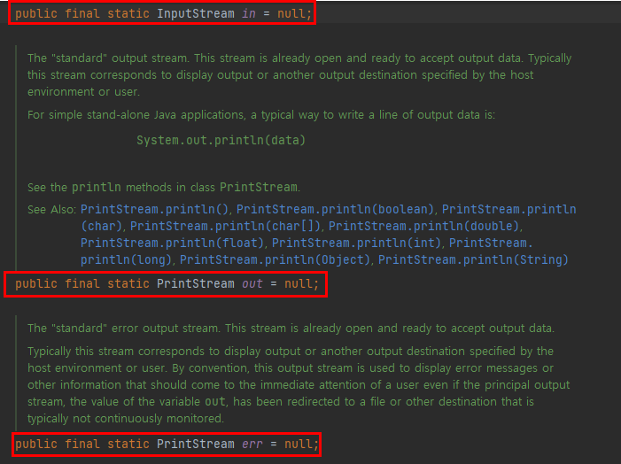
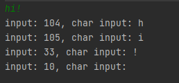
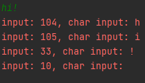

## 스트림 (Stream) / 버퍼 (Buffer) / 채널 (Channel) 기반의 I/O

- 스트림이란?

  데이터를 전달하려면 두 대상을 연결하고 데이터를 전송할 수 있는 무언가가 필요한데, 이를 스트림이라고 한다. 다시말해, 스트림이란 데이터를 운반하는데 사용되는 연결통로이다.

  스트림은 연속적인 데이터의 흐름을 물에 비유하여 붙여진 이름인데, 여러 가지로 유사한 점이 많다. 물이 한쪽 방향으로만 흐르는 것과 같이 스트림은 단방향통신만 가능하기 때문에 하나의 스트림으로 입력과 출력을 동시에 처리할 수 없다. 그래서 입력과 출력을 동시에 수행하려면 입력을 위한 입력 스트림과 출력을 위한 출력 스트림 모두 두 개의 스트림이 필요하다.

  스트림은 먼저 보낸 데이터를 먼저 받게 되어 있으며 중간에 건너뜀 없이 연속적으로 데이터를 주고받는다. 큐와 같은 FIFO구조로 되어있다고 생각하면 이해가 쉬울 것이다.

- 버퍼란?

  버퍼를 설명하기 전 스트림의 구조에 대해 잠시 설명하자면, 스트림은 바이트 기반이다. 또한 스트림은 순서대로 한 바이트씩 제공하도록 설계되어있다. 한 바이트씩 받아서 한 바이트를 출력하는 과정은 성능에 있어 좋은 퍼포먼스를 기대할 수 없다. 이러한 입출력의 성능을 향상시키기 위한 방법 중 하나인 버퍼는 이러한 문제를 해소할 수 있다. 그럼 이제 버퍼에 대해 알아보자.

  버퍼란 읽고 쓰기가 가능한 메모리의 배열을 뜻한다. 위의 스트림에서 한 바이트씩 받아서 한 바이트를 출력하지 않고 버퍼를 사용하게 되면, 일일이 출력하지 않고 버퍼에 계속 담다가, 버퍼에서 제공되는 배열이 꽉차게되면 한번에 출력이 되는 형태이다. 위와 같은 행위를 버퍼링이라고도 부른다. 간혹 심심찮게 버퍼링이라는 단어를 사용할 때가 있는데, 위의 개념을 곱씹으며 비유해본다면 어떠한 느낌인지 감을 잡을 수 있을것이다. 버퍼의 사용을 통해 프로그램의 성능에 큰 영향을 미칠 수 있으므로 입출력을 사용할 때 버퍼의 사용을 항상 고려하는 것이 중요하다.

- 채널이란?

  채널을 설명하기 전, NIO에 대해 배경지식이 있어야한다. NIO에 대해 간략하게 설명하자면, New Input/Output으로 새로운 입출력이라고 보면 된다. IO와 NIO에는 각각 어떠한 특징이 있는지 살펴보자.

  IO는 위에서 설명했듯 스트림 방식이다. 또한 기본으로 버퍼를 제공하고 있지 않기 때문에 버퍼를 따로 설정을 해야하며, 블로킹 방식이다.

  NIO는 스트림 방식이 아닌 채널 방식이다. 버퍼를 기본적으로 제공하며, 블로킹 또는 넌 블로킹 방식을 모두 지원한다.

  위의 IO와 NIO의 각각 특징들을 통해 알 수 있는 것은, 채널은 스트림과는 달리 양방향으로 입력과 출력이 가능하다는 것이다. 그렇기 때문에 입출력을 위한 별도의 채널을 만들 필요가 없으며, 채널에서 데이터를 주고받을 때 기본적으로 버퍼를 사용한다는 특징을 가지고 있다.

## InputStream과 OutputStream
InputStream과 OutputStream은 모든 바이트기반의 스트림의 조상이다. 또한 프로그램이 종료될 때, 사용하고 닫지 않은 스트림을 JVM이 자동적으로 닫아주지만, 스트림을 사용해서 모든 작업을 마치고 난 후에는 close() 메서드를 호출하여 반드시 닫아주어야 한다.


- InputStream
  
  |메서드 명|설명|
  |---|---|
  |int available()|스트림으로부터 읽어 올 수 있는 데이터의 크기를 반환한다.|
  |void close()|스트림을 닫음으로써 사용하고 있던 자원을 반환한다.|
  |void mark(int readlimit)|현재위치를 표시해 놓는다. 후에 reset()에 의해 표시해 놓은 위치로 다시 돌아갈 수 있다. readlimit은 되돌아갈 수 있는 byte의 수이다.|
  |boolean markSupport|mark()와 reset()을 지원하는지를 알려준다. mark()와 reset()기능을 지원하는 것은 선택적이므로, mark()와 reset()을 사용하기 전에 markSupported()를 호출해서 지원여부를 확인해봐야한다.|
  |abstract int read()|1 byte를 읽어온다(0 ~ 255). 더 이상 읽어 올 데이터가 없으면 -1을 반환한다. abstract메서드라서 InputStream의 자손들은 자신의 상황에 맞게 구현해야한다.|
  |int read(byte[] b)|배열 b의 크기만큼 읽어서 배열을 채우고 읽어 온 데이터의 수를 반환한다. 반환하는 값은 항상 배열의 크기보다 작거나 같다.|
  |int read(byte[] b, int off, int len)|최대 len개의 byte를 읽어서, 배열 b의 지정된 위치(off)부터 저장한다. 실제로 읽어올 수 있는 데이터가 len개보다 적을 수 있다.|
  |void reset()|스트림에서의 위치를 마지막으로 mark()이 호출되었던 위치로 되돌린다.|
  |long skip(long n)|스트림에서 주어진 길이(n)만큼을 건너뛴다.|

- OutputStream
  
  |메서드 명|설명|
  |---|---|
  |void close()|입력소스를 닫음으로써 사용하고 있던 자원을 반환한다.|
  |void flush()|스트림의 버퍼에 있는 모든 내용을 출력소스에 쓴다.|
  |abstract void write(int b)|주어진 값을 출력소스에 쓴다.|
  |void write(byte[] b)|주어진 배열 b에 저장된 모든 내용을 출력소스에 쓴다.|
  |void write(byte[] b, int off, int len)|주어진 배열 b에 저장된 내용 중에서 off번째로부터 len개 만큼만을 읽어서 출력소스에 쓴다.|

## Byte와 Character 스트림

- 바이트기반 스트림

  스트림은 바이트단위로 데이터를 전송하며 입출력 대상에 따라 다음과 같은 입/출력 스트림이 있다.

  |입력 스트림|출력 스트림|입출력 대상의 종류|
  |---|---|---|
  |FileInputStream|FileOutputStream|파일|
  |ByteArrayInputStream|ByteArrayOutputStream|메모리(byte배열)|
  |PipedInputStream|PipedOutputStream|프로세스(프로세스간의 통신)|
  |AudioInputStream|AudioOutputStream|오디오장치|

  위와 같이 여러 종류의 입출력 스트림이 있으며, 어떠한 대상에 대해 작업을 할 것인지, 입력을 할 것인지 출력을 할 것인지에 따라 해당 스트림을 선택해서 사용하면 된다.

  위는 모두 InputStream과 OutputStream의 자손들이며 각각 읽고 쓰는데 필요한 추상메서드를 자신에 맞게 구현되었다.

  |InputStream|OutputStream|
  |---|---|
  |abstract int read()|abstract void write(int b)|
  |int read(byte[] b)|void write(byte[] b)|
  |int read(byte[] b, int off, int len)|void write(byte[] b, int off, int len)|

  위의 표에서 read()와 write()는 입출력의 대상에 따라 쓰는 방법이 다를 것이기 때문에 각 상황에 맞게 구현하라는 의미에서 추상메서드로 정의되어 있다. 나머지는 추상메서드가 아니지만 두 메서드가 구현되어야만 사용할 수 있기 때문에 구현하지 않으면 사용할 수 없다.

- 문자기반 스트림

  바이트 기반의 스트림은 입출력의 단위가 1 byte이다. Java에서는 한 문자를 의미하는 char형이 1 byte가 아닌 2 byte로, 바이트 기반의 스트림으로 2 byte인 문자를 처리하는 데는 어려움이 있다. 이 점을 보완하기 위해 문자 기반의 스트림이 제공된다. 문자 데이터를 입출력할 때는 바이트 기반 스트림 대신 문자 기반 스트림을 사용하면 된다.
  
  |바이트 기반 스트림|문자 기반 스트림|
  |---|---|
  |FileInputStream<br>FileOutputStream|FileReader<br>FileWriter|
  |ByteArrayInputStream<br>ByteArrayOutputStream|CharArrayReader<br>CharArrayWriter|
  |PipedInputStream<br>PipedOutputStream|PipedReader<br>PipedWriter|
  |StringBufferInputStream(deprecated)<br>StringBufferOutputStream(deprecated)|StringReader<br>StringWriter|

  InputStream은 Reader로, OutputStream은 Writer로 생각하면 된다. 예시로, FileInputStream은 FileReader로, FileOutputStream은 FileWriter로 대체가 가능하다. 단, 예외로 ByteArrayInputStream과 ByteArrayOutputStream은 CharArrayReader와 CharArrayWriter로 사용하면된다.

  |InputStream|Reader|
  |---|---|
  |abstract int read()<br>int read(byte[] b)<br>int read(byte[] b, int off, int len)|int read()<br>int read(char[] cbuf)<br>abstact int read(char[] cbuf, int off, int len)|

  |OutputStream|Writer|
  |---|---|
  |abstract void write(int b)<br>void write(byte[] b)<br>void write(byte[]b, int off, int len)|void write(int c)<br>void write(char[] cbuf)<br>abstract void write(char[] cbuf, int off, int len)<br>void write(String str)<br>void write(String str, int off, int len)|

  바이트 기반 스트림과 문자 기반 스트림의 읽기와 쓰기에 사용되는 메서드를 비교하였다. 매개변수로 byte 배열 대신 char 배열로 바뀌었다는 것과 추상 메서드가 달라진 것을 차이점으로 볼 수 있다.

  다음은 보조 스트림으로, 사용 목적과 방식은 바이트 기반 보조 스트림과 다를게 없다.

  |바이트 기반 보조 스트림|문자 기반 보조 스트림|
  |---|---|
  |BufferedInputStream<br>BufferedOutputStream|BufferedReader<br>BufferedWriter|
  |FilterInputStream<br>FilterOutputStream|FilterReader<br>FilterWriter|
  |LineNumberInputStream(deprecated)|LineNumberReader|
  |PrintStream|PrintWriter|
  |PushbackInputStream|PushbackReader|

## 표준 스트림 (System.in, System.out, System.err)

표준 스트림은 콘솔을 통한 데이터 입력과 콘솔로의 데이터 출력을 의미한다. 자바에서는 표준 입출력(standard I/O)을 위해 세 가지 입출력 스트림, System.in, System.out, System.err을 제공하는데, 이 들은 자바 어플리케이션의 실행과 동시에 사용할 수 있게 자동적으로 생성되기 때문에 별도로 생성하는 코드를 생성하지 않고도 사용이 가능하다.



위 System 클래스의 in, out, err 메서드는 모두 static 변수들이다. 타입을 보면 InputStream, PrintStream이지만 실제로 버퍼를 이용하는 BufferedInputStream과 BufferedOutputStream의 인스턴스를 사용한다.

- System.in : 콘솔로부터 데이터를 입력받는데 사용

    ```jsx
    import java.io.*;

    public class Test {
        public static void main(String[] args) throws IOException {
            int input = 0;

            while((input = System.in.read()) != -1) {
                System.out.println("input: " + input + ", char input: " + (char)input);
            }
        }
    }
    ```

  

  hi라고 입력했을 때 read() 메서드가 -1를 출력할 때까지 반복문이 돌아가는 구성이다. 엔터키를 입력하면 입력대기상태에서 벗어나 입력된 데이터를 모두 읽는 구조이다. 마지막에 빈 문자열이 생기는 이유는 엔터키의 입력 때문이다. 엔터키를 입력하는 것은 특수문자 \n이 입력되는 것으로 간주된다. 그렇기 때문에 맨 마지막은 빈 문자열을 출력한다. 이러한 불편함을 해소하고자 BufferedReader의 readLine()을 사용하는 것도 방법 중 하나이다.

- System.out : 콘솔로 데이터를 출력하는데 사용

  위의 사진자료에서 알 수 있듯 System.out.println()을 통해 출력이 된 형태임을 알 수 있다.

- System.err : 콘솔로 데이터를 출력하는데 사용

  만약 System.err.println()으로 설정한다면,

  


  평소 예외나 오류가 발생했을 때의 글씨색으로 출력되는 것을 확인할 수 있다. 이를 통해 알 수 있는 사실은 System.err은 특별한 상황에서만 사용됨을 짐작할 수 있다.

## 파일 읽고 쓰기

자료참조

자바의 정석 3rd Edition(남궁 성 저)

[https://deftkang.tistory.com/25](https://deftkang.tistory.com/25)